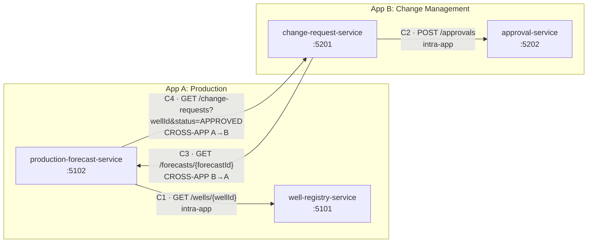

# Specmatic Prototype — Contract Testing Evaluation

> Status: **Phase 1 complete** (structure, services and design). Later sections are placeholders until their phase runs.

## 1. Purpose and scope
Evaluate whether **Specmatic (open-source edition)** fits contract testing for an enterprise stack: Angular MFEs, .NET 10 microservices, Azure DevOps pipelines and OAuth2.
The prototype uses two small "applications" with four services: App A Production (oil & gas) and App B Change Management. Calls go both within an app and across apps.
The output is evidence for a **Go / Conditional Go / No-Go** decision.

Out of scope: production-grade code, real OAuth2 identity provider, Angular front-ends (noted as a limitation).

## 2. Environment and versions
Checked on 2026-09-28 (Windows 11 Pro 10.0.26200).

| Tool | Required? | Found version | Status | Action needed |
|---|---|---|---|---|
| .NET SDK | Yes | 10.0.101 (also 9.0.307) | OK | None |
| git | Yes | 2.53.0.windows.1, user.name/user.email configured globally | OK | Optional: global email is personal; set a repo-local identity in `contracts/` if needed |
| Docker Desktop | Yes (chosen route) | Client/Engine 28.3.3, engine running (WSL2) | OK technically | **Licence to be confirmed with IT** (see below) |
| Java | Only for JAR fallback | Oracle JDK 21.0.10 LTS | OK (17+) | None |
| Node.js / npm | Optional | 22.19.0 / 10.9.3 | OK | None |
| PowerShell | Yes | Windows PowerShell 5.1 (execution policy RemoteSigned for the current user) | OK | Scripts are written for 5.1 |
| VS Code C# extensions | Recommended | None installed (only Claude Code, Playwright) | Missing, not blocking | Optional: `ms-dotnettools.csdevkit` |
| **Specmatic** | Yes | **2.55.0** Docker image `specmatic/specmatic:2.55.0` (digest `sha256:422f8796…`) | Installed | None |

**Network:** Docker Hub, Maven Central, NuGet, docs.specmatic.io and GitHub are all reachable directly (no corporate proxy is active).

**Docker Desktop licence:** the organisation has not pushed any Docker admin policy. Docker's terms require a paid seat for commercial use at large organisations, so this **must be confirmed with IT**. If Docker is not allowed, the fallback is Java 21 plus a standalone Specmatic JAR. Note that the Maven Central `specmatic-executable` JAR is a 0.4 MB thin JAR, so the correct standalone download would have to be confirmed first.

**Why Docker:** the image is self-contained, the version is pinned, and the same image runs on Azure DevOps Linux agents. Services run on the Windows host and the container reaches them via `http://host.docker.internal:<port>`. **This was verified in Phase 1** (see `results/phase1/docker-to-host-check.txt`): a service bound only to `localhost` on Windows is reachable from the container, so no firewall change is needed.

**Specmatic licence (important finding):** `show-license` reports a bundled **"Specmatic OSS" licence**, type OSS, rate limit unlimited, **expiry 14 Dec 2027**. The code is MIT on GitHub, but the runtime still checks a licence file baked into the image. Staying on the free edition therefore means upgrading the image before that date. See `results/phase0/show-license.txt`.

**Commands available in 2.55.0** (from `--help`, saved in `results/phase0/`):
`test`, `stub`/`mock`/`virtualize`, `backward-compatibility-check`, `examples`, `proxy`, `config`, `import`, `mcp`. There are also Insights and licence commands (`send-report`, `get-license`, `show-license`) that relate to the paid hosted Specmatic Insights product.

Early observations from the help text (to verify in later phases):
- `test` has `--junitReportDir`, `--filter` (METHOD/PATH/STATUS), `--examples`, `--strict` (no generated tests for endpoints without examples), `--testBaseURL`, `--overlay-file`.
- `backward-compatibility-check` is **git-based**: it compares changed files against `--base-branch` in `--repo-dir`. It does not take two file paths. The older two-file `compare` command is deprecated. Comparing against a **tag** (v1) needs to be tested in Phase 5.
- The `--strict` flag on `backward-compatibility-check` is **"only applicable when using Specmatic Insights"** (paid/hosted). Without it, breaking changes to APIs "that have no usages" produce warnings only. This matters for Phase 5.

### Repositories
The prototype uses **two independent git repositories**. Both use the `main` branch and are MIT licensed.

| Repo | Local folder | GitHub (public) | Contains |
|---|---|---|---|
| Prototype | `./` (root) | `Raghul5823/specmatic-prototype` | services, tests, scripts, results, this README |
| Contracts | `./contracts/` | `Raghul5823/specmatic-prototype-contracts` | OpenAPI specs, shared schemas, examples, `consumers.yaml`, tags `v1`, … |

- The root `.gitignore` excludes `contracts/`, so the two repos never overlap. This simulates a central contract repo that is owned and versioned separately from the service code.
- Specmatic always reads specs from the **local** `contracts/` repo (a git checkout). GitHub is only for backup and sharing, so Specmatic never needs GitHub credentials.
- The machine this runs on has a git repository in a parent folder. The prototype root is its own repository (`git rev-parse --show-toplevel` returns the prototype folder), and nothing is ever committed to the parent repo.
- Committed files contain no local machine paths, secrets or organisation-specific names. Service logs (`*.log`) are not committed because they contain absolute paths.

## 3. Architecture diagram, ports and call map


Arrows point from **consumer → provider**.

### Ports
| Service | App | Port | Planned Specmatic stub port (Phases 4–5) |
|---|---|---|---|
| well-registry-service | A | 5101 | 9101 |
| production-forecast-service | A | 5102 | 9102 |
| change-request-service | B | 5201 | 9201 |
| approval-service | B | 5202 | 9202 |

### Call map
| # | Consumer | Provider | Endpoint | Type | Triggered by | Fields the consumer relies on |
|---|---|---|---|---|---|---|
| C1 | production-forecast | well-registry | `GET /wells/{wellId}` | intra-app (A) | `POST /forecasts` | `id, name, status, dailyCapacityBbl`; 404 = unknown well |
| C2 | change-request | approval | `POST /approvals` | intra-app (B) | `POST /change-requests` | sends `changeRequestId, type, capacityDeltaBbl`; reads `id, decision, reason`; expects 201 |
| C3 | change-request | production-forecast | `GET /forecasts/{forecastId}` | **cross-app B→A** | `POST /change-requests` (only when `forecastId` is given) | `id, wellId`; 404 = unknown forecast |
| C4 | production-forecast | change-request | `GET /change-requests?wellId=&status=APPROVED` | **cross-app A→B** | `POST /forecasts` | `id, wellId, status, capacityDeltaBbl` |

**Why the two-way cross-app calls cannot loop:** each direction uses a different endpoint, and the endpoint being called makes no outbound calls.
- `POST /forecasts` calls `GET /change-requests`, which only reads the in-memory store.
- `POST /change-requests` calls `GET /forecasts/{id}`, which only reads the in-memory store.

The endpoints that fan out (the two POSTs) are never called by another service.

### Endpoint inventory
Every endpoint except `/health` requires `Authorization: Bearer test-token-123`.

| Service | Endpoint | Success | Errors |
|---|---|---|---|
| well-registry | `GET /wells?status=ACTIVE\|SHUT_IN\|ABANDONED` | 200 list | 400, 401 |
| | `GET /wells/{wellId}` (pattern `W-000`) | 200 | 400, 401, 404 |
| | `POST /wells` | 201 + `Location` | 400, 401 |
| production-forecast | `POST /forecasts` | 201 + `Location` | 400 (validation, unknown or non-ACTIVE well), 401, 502 (downstream failure) |
| | `GET /forecasts/{forecastId}` (pattern `F-0000`) | 200 | 400, 401, 404 |
| change-request | `POST /change-requests` | 201 + `Location` | 400 (validation, unknown forecast or forecast for a different well), 401, 502 |
| | `GET /change-requests?wellId=&status=APPROVED\|REJECTED` | 200 list | 400, 401 |
| | `GET /change-requests/{changeRequestId}` (pattern `CR-0000`) | 200 | 400, 401, 404 |
| approval | `POST /approvals` (rule: `abs(capacityDeltaBbl) <= 500` → APPROVED, otherwise REJECTED) | 201 + `Location` | 400, 401 |
| | `GET /approvals/{approvalId}` (pattern `A-0000`) | 200 | 400, 401, 404 |

**Seed data** (fixed, so that Phase 2 examples can match it):
- Wells: `W-001` Eagle-1 (ACTIVE, 1200 bbl/d), `W-002` Eagle-2 (ACTIVE, 800), `W-003` Permian-7 (SHUT_IN, 0).
- Forecast: `F-5001` for W-001.
- Change requests: `CR-1001` (W-001, +150, APPROVED) and `CR-1002` (W-001, +900, REJECTED).
- Approvals: `A-7001` and `A-7002`.

### Folder layout
```
Specmatic Prototype/
├─ README.md                      <- this file (main deliverable)
├─ SpecmaticPrototype.sln         <- builds all projects
├─ contracts/                     <- SEPARATE git repo (central contract repo); specs from Phase 2
│   ├─ specs/app-a-production/ , specs/app-b-change-mgmt/ , common/
│   └─ consumers.yaml             <- (Phase 2) who uses which endpoint
├─ shared/Prototype.ServiceDefaults/   <- JSON rules, bearer check, ProblemDetails, HttpClient helper
├─ app-a-production/
│   ├─ well-registry-service/          Program.cs, WellEndpoints.cs -> WellService.cs -> WellRepository.cs
│   └─ production-forecast-service/    ForecastEndpoints.cs -> ForecastService.cs -> Clients.cs / ForecastRepository.cs
├─ app-b-change-mgmt/
│   ├─ change-request-service/         ChangeRequestEndpoints.cs -> ChangeRequestManager.cs -> Clients.cs / Repository
│   └─ approval-service/               ApprovalEndpoints.cs -> ApprovalPolicy.cs -> ApprovalRepository.cs
├─ scripts/                       <- common.ps1, start-services.ps1, stop-services.ps1, smoke-test.ps1 (run-all.ps1 in Phase 6)
└─ results/                       <- evidence per phase (phase0/, phase1/, case1/ ...), logs/
```

### Design decisions (and why they matter for Specmatic)
| Decision | Why |
|---|---|
| **Contract-first:** specs are hand-written in `contracts/`, not generated from code | The central repo is the source of truth. A spec generated from code would just agree with whatever the code does, bugs included. |
| Each service has **endpoint → service → repository** layers behind interfaces | Phase 3b: shows the internal layer that Specmatic cannot see (it only sees HTTP). |
| **Strict JSON:** no numbers-as-strings, no integer enums, no nulls for required fields | Lets Specmatic's negative tests (wrong type, wrong enum value) get a 400, not a silent coercion. |
| Every error is **RFC 9457 ProblemDetails** (`application/problem+json`), including 401 and unknown routes | One error schema that can be put in the spec and checked. |
| **Fixed test token** in `Auth:Token` (middleware); outbound calls send `Downstream:Token` | Stand-in for OAuth2, so we can see how Specmatic supplies the token in test and stub mode. |
| **Consumer DTOs hold only the fields they use** (e.g. `WellSummary` has 4 of the provider's 8 fields); a missing field fails deserialisation and gives a 502 | This mirrors what consumer examples and `consumers.yaml` should record. A provider change to an unused field shouldn't break the consumer. |
| Downstream base URLs come from config, overridable by env var (e.g. `Downstream__WellRegistryBaseUrl=http://localhost:9101`) | Phases 4–5 point a consumer at a Specmatic stub without changing code. |
| Unavailable or unexpected downstream → **502 ProblemDetails** | A consumer's reaction to a provider breaking the contract is visible and testable. |

## 4. How Specmatic works
_Phase 2 (spec → test, spec → stub, compatibility check)._

## 5. Phase-by-phase log

### Tracked items (open, from Phase 0)
| # | Item | Where it will be checked |
|---|---|---|
| T1 | Does `backward-compatibility-check` **fail** (non-zero exit code) or only **warn** on a breaking change without Insights? If it only warns, record that and test **oasdiff** (free) as an alternative compatibility gate. | Phase 5 |
| T2 | The bundled OSS licence expires **14 Dec 2027**. Record it as a maintenance risk. | Phase 7 scorecard |
| T3 | **Never commit to the outer git repo** in the home folder. Only `contracts/` is committed. | All phases |

### Phase 0 — Environment check
- **Done:** read-only checks of the tools, network and proxy, and published Specmatic versions (Docker Hub, Maven Central and GitHub all show 2.55.0 as latest, released 2026-09-24).
- **Installed (with approval):** `docker pull specmatic/specmatic:2.55.0` (522 MB on disk).
- **Commands run:**
  ```powershell
  docker run --rm specmatic/specmatic:2.55.0 --version
  docker run --rm specmatic/specmatic:2.55.0 --help
  docker run --rm specmatic/specmatic:2.55.0 test --help
  docker run --rm specmatic/specmatic:2.55.0 stub --help
  docker run --rm specmatic/specmatic:2.55.0 backward-compatibility-check --help
  docker run --rm specmatic/specmatic:2.55.0 show-license
  ```
- **Produced:** `results/phase0/*.txt`.
- **What to notice:** the free edition has an expiring bundled licence; the compatibility check depends on git; and some flags only work with Insights (the paid product).

### Phase 1 — Project structure and design
- **Done:**
  - Created 4 minimal-API services (net10.0) and a shared defaults library, all in `SpecmaticPrototype.sln`.
  - Added PowerShell scripts to start, stop and smoke-test the services.
  - Ran `git init -b main` inside `contracts/`; nothing is committed yet (commit + tag `v1` in Phase 2).
- **Nothing installed:** `dotnet new web` / `dotnet new sln` use only the SDK, and no NuGet packages are referenced.
- **Commands run:**
  ```powershell
  dotnet new web -n WellRegistryService -o app-a-production\well-registry-service -f net10.0   # x4
  dotnet new sln -n SpecmaticPrototype ; dotnet sln add ...                                    # 5 projects
  dotnet build SpecmaticPrototype.sln            # 0 warnings, 0 errors
  .\scripts\start-services.ps1 ; .\scripts\smoke-test.ps1 ; .\scripts\stop-services.ps1
  docker run --rm --entrypoint curl specmatic/specmatic:2.55.0 -s -i -H "Authorization: Bearer test-token-123" http://host.docker.internal:5101/wells/W-001
  git -C contracts init -b main
  ```
- **Produced:**
  - `results/phase1/smoke-test.txt`: **14/14 passed**. Covers happy paths, 401 without a token, 400 ProblemDetails with per-field `errors`, a string sent for a number rejected with 400, 404 ProblemDetails, and both cross-app chains. `POST /forecasts` for W-001 gives effective capacity 1350 = 1200 + approved CR-1001 (+150).
  - `results/phase1/docker-to-host-check.txt`: HTTP 200 from inside the Specmatic container.
- **What to notice:**
  - The two cross-app directions use different endpoints (C3 vs C4), so they cannot loop.
  - A malformed body (wrong JSON type) returns a generic 400 ProblemDetails with no `errors` map. A well-formed body with missing or invalid fields returns 400 with an `errors` map. Both are ProblemDetails, so the spec's 400 schema must make `errors` optional.

## 6. Break-experiment results
_Phases 3–5._

| Change | Expected | Caught? | Evidence |
|---|---|---|---|

## 7. Coverage
_Phase 7._

## 8. Control points
_Phase 7._

## 9. Scorecard
_Phase 7._ Pre-recorded risk: **T2**, the bundled OSS licence expires 14 Dec 2027.

## 10. Limitations and recommendation
_Phase 7._

## 11. How to rerun everything from scratch
1. Prerequisites: .NET SDK 10.0.101, Docker Desktop (engine running), git.
2. `docker pull specmatic/specmatic:2.55.0`
3. From the prototype root:
   ```powershell
   dotnet build SpecmaticPrototype.sln
   .\scripts\start-services.ps1 -NoBuild      # starts all 4 on 5101/5102/5201/5202, logs in results\logs
   .\scripts\smoke-test.ps1                   # expects 14/14
   .\scripts\stop-services.ps1
   ```
4. _Further steps added as phases complete (`scripts/run-all.ps1` in Phase 6)._
