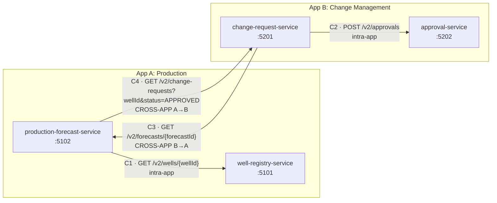
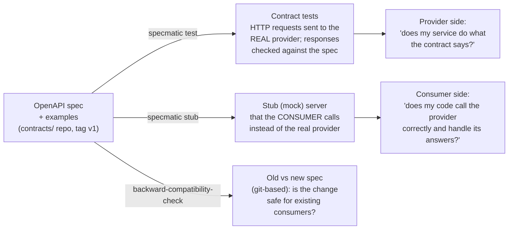

# Specmatic Prototype — Contract Testing Evaluation

> Status: **Phase 2 complete** (contracts `v1`). Later sections are placeholders until their phase runs.

## 1. Purpose and scope
Evaluate whether **Specmatic (open-source edition)** fits contract testing for an enterprise stack: Angular MFEs, .NET 10 microservices, Azure DevOps pipelines and OAuth2.
The prototype uses two small "applications" with four services: App A Production (oil & gas) and App B Change Management. Calls go both within an app and across apps. A minimal Angular app acts as an MFE consumer.
The output is evidence for a **Go / Conditional Go / No-Go** decision.

Out of scope: production-grade code, a real OAuth2 identity provider, and a full MFE shell (Module Federation). Phase 6 uses one plain Angular CLI app as the MFE stand-in.

### Phase plan
| Phase | Title | Status |
|---|---|---|
| 0 | Environment check | ✅ done |
| 1 | Project structure and design | ✅ done |
| 2 | Contracts (specs, examples, `consumers.yaml`, tag `v1`); services moved under `/v2` with `/liveness` and `/readiness` | ✅ done |
| 3 | Case 1: a service's own API (provider tests, reports, xUnit for the internal layer, break experiments) | next |
| 4 | Case 2: service-to-service within an app, both directions (provider tests + consumer tests against stubs) | |
| 5 | Case 3: cross-application, both directions, specs from the central `contracts/` repo; backward-compatibility check against `v1`; drift | |
| 6 | **Minimal Angular MFE consumer**: generated TypeScript client from the spec, contract break as a compile error, Playwright against a Specmatic stub via the dev-server proxy | |
| 7 | Pipeline simulation: `run-all.ps1` + sample `azure-pipelines.yml` (**BuildService** stage with unit tests, xUnit `ContractTests` projects and the Angular steps; the deploy stage depends on it) | |
| 8 | Evaluation: coverage, control points, scorecard (incl. "Angular MFE consumer support"), limitations, recommendation | |

## 2. Environment and versions
Checked on 2026-09-28 (Windows 11 Pro 10.0.26200).

| Tool | Required? | Found version | Status | Action needed |
|---|---|---|---|---|
| .NET SDK | Yes | 10.0.101 (also 9.0.307) | OK | None |
| git | Yes | 2.53.0.windows.1, user.name/user.email configured globally | OK | Optional: global email is personal; set a repo-local identity in `contracts/` if needed |
| Docker Desktop | Yes (chosen route) | Client/Engine 28.3.3, engine running (WSL2) | OK technically | **Licence to be confirmed with IT** (see below) |
| Java | Only for JAR fallback | Oracle JDK 21.0.10 LTS | OK (17+) | None |
| Node.js / npm | Optional | 22.19.0 / 10.9.3 | OK | None |
| PowerShell | Yes | Windows PowerShell 5.1 (execution policy RemoteSigned for the current user) | OK | Scripts are written for 5.1 |
| VS Code C# extensions | Recommended | None installed (only Claude Code, Playwright) | Missing, not blocking | Optional: `ms-dotnettools.csdevkit` |
| **Specmatic** | Yes | **2.55.0** Docker image `specmatic/specmatic:2.55.0` (digest `sha256:422f8796…`) | Installed | None |

**Network:** Docker Hub, Maven Central, NuGet, docs.specmatic.io and GitHub are all reachable directly (no corporate proxy is active).

**Docker Desktop licence:** the organisation has not pushed any Docker admin policy. Docker's terms require a paid seat for commercial use at large organisations, so this **must be confirmed with IT**. If Docker is not allowed, the fallback is Java 21 plus a standalone Specmatic JAR. Note that the Maven Central `specmatic-executable` JAR is a 0.4 MB thin JAR, so the correct standalone download would have to be confirmed first.

**Why Docker:** the image is self-contained, the version is pinned, and the same image runs on Azure DevOps Linux agents. Services run on the Windows host and the container reaches them via `http://host.docker.internal:<port>`. **This was verified in Phase 1** (see `results/phase1/docker-to-host-check.txt`): a service bound only to `localhost` on Windows is reachable from the container, so no firewall change is needed.

**Specmatic licence (important finding):** `show-license` reports a bundled **"Specmatic OSS" licence**, type OSS, rate limit unlimited, **expiry 14 Dec 2027**. The code is MIT on GitHub, but the runtime still checks a licence file baked into the image. Staying on the free edition therefore means upgrading the image before that date. See `results/phase0/show-license.txt`.

**Commands available in 2.55.0** (from `--help`, saved in `results/phase0/`):
`test`, `stub`/`mock`/`virtualize`, `backward-compatibility-check`, `examples`, `proxy`, `config`, `import`, `mcp`. There are also Insights and licence commands (`send-report`, `get-license`, `show-license`) that relate to the paid hosted Specmatic Insights product.

Early observations from the help text (to verify in later phases):
- `test` has `--junitReportDir`, `--filter` (METHOD/PATH/STATUS), `--examples`, `--strict` (no generated tests for endpoints without examples), `--testBaseURL`, `--overlay-file`.
- `backward-compatibility-check` is **git-based**: it compares changed files against `--base-branch` in `--repo-dir`. It does not take two file paths. The older two-file `compare` command is deprecated. Comparing against a **tag** (v1) needs to be tested in Phase 5.
- The `--strict` flag on `backward-compatibility-check` is **"only applicable when using Specmatic Insights"** (paid/hosted). Without it, breaking changes to APIs "that have no usages" produce warnings only. This matters for Phase 5.
- Configuration: the current docs use **`specmatic.yaml` version 3** (`systemUnderTest`, `dependencies`, `components.sources/services/runOptions`). Version 2 (`contracts`, `provides`, `consumes`) is still documented. We add a config file only when a phase needs one.
- Docs marked **commercial-only** (not usable by us): the interactive examples GUI, template values in examples (e.g. `${API_TOKEN:...}`), just-in-time auth tokens via fixtures, detection of competing examples, gRPC and GraphQL mocks. The docs source was read from the public `specmatic/docs.specmatic.io` repo, because the site renders client-side.

### Repositories
The prototype uses **two independent git repositories**. Both use the `main` branch and are MIT licensed.

| Repo | Local folder | GitHub (public) | Contains |
|---|---|---|---|
| Prototype | `./` (root) | `Raghul5823/specmatic-prototype` | services, tests, scripts, results, this README |
| Contracts | `./contracts/` | `Raghul5823/specmatic-prototype-contracts` | OpenAPI specs, shared schemas, examples, `consumers.yaml`, tags `v1`, … |

- The root `.gitignore` excludes `contracts/`, so the two repos never overlap. This simulates a central contract repo that is owned and versioned separately from the service code.
- Specmatic always reads specs from the **local** `contracts/` repo (a git checkout). GitHub is only for backup and sharing, so Specmatic never needs GitHub credentials.
- The machine this runs on has a git repository in a parent folder. The prototype root is its own repository (`git rev-parse --show-toplevel` returns the prototype folder), and nothing is ever committed to the parent repo.
- Committed files contain no local machine paths, secrets or organisation-specific names. Service logs (`*.log`) are not committed because they contain absolute paths.

## 3. Architecture diagram, ports and call map


Arrows point from **consumer → provider**. All business endpoints are under the **`/v2` base path**, matching the ingress route in our real Helm setup. Each service also exposes **`/liveness`** and **`/readiness`** at the root, with no auth; these are not in the contracts (see §4).

### Ports
| Service | App | Port | Planned Specmatic stub port (Phases 4–5) |
|---|---|---|---|
| well-registry-service | A | 5101 | 9101 |
| production-forecast-service | A | 5102 | 9102 |
| change-request-service | B | 5201 | 9201 |
| approval-service | B | 5202 | 9202 |

### Call map
| # | Consumer | Provider | Endpoint | Type | Triggered by | Fields the consumer relies on |
|---|---|---|---|---|---|---|
| C1 | production-forecast | well-registry | `GET /wells/{wellId}` | intra-app (A) | `POST /forecasts` | `id, name, status, dailyCapacityBbl`; 404 = unknown well |
| C2 | change-request | approval | `POST /approvals` | intra-app (B) | `POST /change-requests` | sends `changeRequestId, type, capacityDeltaBbl`; reads `id, decision, reason`; expects 201 |
| C3 | change-request | production-forecast | `GET /forecasts/{forecastId}` | **cross-app B→A** | `POST /change-requests` (only when `forecastId` is given) | `id, wellId`; 404 = unknown forecast |
| C4 | production-forecast | change-request | `GET /change-requests?wellId=&status=APPROVED` | **cross-app A→B** | `POST /forecasts` | `id, wellId, status, capacityDeltaBbl` |

**Why the two-way cross-app calls cannot loop:** each direction uses a different endpoint, and the endpoint being called makes no outbound calls.
- `POST /forecasts` calls `GET /change-requests`, which only reads the in-memory store.
- `POST /change-requests` calls `GET /forecasts/{id}`, which only reads the in-memory store.

The endpoints that fan out (the two POSTs) are never called by another service.

### Endpoint inventory
Every business endpoint requires `Authorization: Bearer test-token-123`. The probes don't.
Paths below are relative to the `/v2` base path (e.g. `GET /wells` is `GET /v2/wells`), the same way the specs write them.

| Service | Endpoint | Success | Errors |
|---|---|---|---|
| well-registry | `GET /wells?status=ACTIVE\|SHUT_IN\|ABANDONED` | 200 list | 400, 401 |
| | `GET /wells/{wellId}` (pattern `W-000`) | 200 | 400, 401, 404 |
| | `POST /wells` | 201 + `Location` | 400, 401 |
| production-forecast | `POST /forecasts` | 201 + `Location` | 400 (validation, unknown or non-ACTIVE well), 401, 502 (downstream failure) |
| | `GET /forecasts/{forecastId}` (pattern `F-0000`) | 200 | 400, 401, 404 |
| change-request | `POST /change-requests` | 201 + `Location` | 400 (validation, unknown forecast or forecast for a different well), 401, 502 |
| | `GET /change-requests?wellId=&status=APPROVED\|REJECTED` | 200 list | 400, 401 |
| | `GET /change-requests/{changeRequestId}` (pattern `CR-0000`) | 200 | 400, 401, 404 |
| approval | `POST /approvals` (rule: `abs(capacityDeltaBbl) <= 500` → APPROVED, otherwise REJECTED) | 201 + `Location` | 400, 401 |
| | `GET /approvals/{approvalId}` (pattern `A-0000`) | 200 | 400, 401, 404 |
| all four | `GET /liveness`, `GET /readiness` (root, **not** under `/v2`, no auth, **not in the contracts**) | 200 | – |

**Seed data** (fixed, so that Phase 2 examples can match it):
- Wells: `W-001` Eagle-1 (ACTIVE, 1200 bbl/d), `W-002` Eagle-2 (ACTIVE, 800), `W-003` Permian-7 (SHUT_IN, 0).
- Forecast: `F-5001` for W-001.
- Change requests: `CR-1001` (W-001, +150, APPROVED) and `CR-1002` (W-001, +900, REJECTED).
- Approvals: `A-7001` and `A-7002`.

### Folder layout
```
Specmatic Prototype/
├─ README.md                      <- this file (main deliverable)
├─ SpecmaticPrototype.sln         <- builds all projects
├─ contracts/                     <- SEPARATE git repo (central contract repo), tagged v1
│   ├─ common/common.yaml         <- shared ProblemDetails + 400/401/404/502 responses
│   ├─ specs/app-a-production/    <- well-registry-service.yaml, production-forecast-service.yaml (+ *_examples/)
│   ├─ specs/app-b-change-mgmt/   <- change-request-service.yaml, approval-service.yaml (+ *_examples/)
│   └─ consumers.yaml             <- who uses which endpoint and fields (our governance file)
├─ shared/Prototype.ServiceDefaults/   <- JSON rules, bearer check, ProblemDetails, HttpClient helper
├─ app-a-production/
│   ├─ well-registry-service/          Program.cs, WellEndpoints.cs -> WellService.cs -> WellRepository.cs
│   └─ production-forecast-service/    ForecastEndpoints.cs -> ForecastService.cs -> Clients.cs / ForecastRepository.cs
├─ app-b-change-mgmt/
│   ├─ change-request-service/         ChangeRequestEndpoints.cs -> ChangeRequestManager.cs -> Clients.cs / Repository
│   └─ approval-service/               ApprovalEndpoints.cs -> ApprovalPolicy.cs -> ApprovalRepository.cs
├─ scripts/                       <- common.ps1, start-services.ps1, stop-services.ps1, smoke-test.ps1 (run-all.ps1 in Phase 7)
└─ results/                       <- evidence per phase (phase0/, phase1/, case1/ ...), logs/
```

### Design decisions (and why they matter for Specmatic)
| Decision | Why |
|---|---|
| **Contract-first:** specs are hand-written in `contracts/`, not generated from code | The central repo is the source of truth. A spec generated from code would just agree with whatever the code does, bugs included. |
| Each service has **endpoint → service → repository** layers behind interfaces | Phase 3b: shows the internal layer that Specmatic cannot see (it only sees HTTP). |
| **Strict JSON:** no numbers-as-strings, no integer enums, no nulls for required fields | Lets Specmatic's negative tests (wrong type, wrong enum value) get a 400, not a silent coercion. |
| Every error is **RFC 9457 ProblemDetails** (`application/problem+json`), including 401 and unknown routes | One error schema that can be put in the spec and checked. |
| **Fixed test token** in `Auth:Token` (middleware); outbound calls send `Downstream:Token` | Stand-in for OAuth2, so we can see how Specmatic supplies the token in test and stub mode. |
| **Consumer DTOs hold only the fields they use** (e.g. `WellSummary` has 4 of the provider's 8 fields); a missing field fails deserialisation and gives a 502 | This mirrors what consumer examples and `consumers.yaml` should record. A provider change to an unused field shouldn't break the consumer. |
| Downstream base URLs come from config and **include the provider's base path** (`http://localhost:5101/v2/`); clients use relative paths (`wells/W-001`). The URL can be overridden by env var (e.g. `Downstream__WellRegistryBaseUrl=http://localhost:9101/`) | Phases 4–5 point a consumer at a Specmatic stub without changing code. A Specmatic stub serves at the root by default (see §4), so for a stub the URL has no `/v2`. |
| Business endpoints under **`/v2`**, probes `/liveness` and `/readiness` at the root without auth | Mirrors our real Helm and ingress setup. |
| Unavailable or unexpected downstream → **502 ProblemDetails** | A consumer's reaction to a provider breaking the contract is visible and testable. |

## 4. How Specmatic works
One OpenAPI spec is used in three ways. Nothing is generated into code: Specmatic reads the spec at runtime.



### 4.1 Spec → test (provider side)
- Specmatic turns each **operation + response** in the spec into test scenarios. It sends real HTTP requests to the running provider and checks the status code, headers and body against the spec.
- **Examples drive the test data.** A parameter or request-body example and a response example with the **same name** (e.g. `GET_W001`) form one test: "send wellId=W-001, expect 200 shaped like `Well`". Consumer-contributed external examples (`*_examples/*.json`) also become provider tests. This is how a consumer's expectation is checked against the real provider.
- Operations without examples still get tests, with values generated from the schema. Negative and generative tests are checked in Phase 3.
- **Observed in 2.55.0 (probe, Phase 2):**
  - **The `servers` URL is ignored.** The base path must go in `--testBaseURL http://host.docker.internal:5101/v2`. Without it, Specmatic called `/wells/W-001` and missed the service.
  - **Auth:** for a `bearer` security scheme, Specmatic sends a **random** token (`Authorization: Bearer LOVWO`) unless one is supplied. That gave 401 and a failed test. Supplying it as an env var named after the scheme (`-e bearerAuth=test-token-123`) worked. `specmatic.yaml` `securitySchemes` is the documented alternative.
  - **Response schemas are treated as closed:** extra response fields fail with `R2003 Unknown property`, even without `additionalProperties: false`. So adding a response field needs a spec change first.

### 4.2 Spec → stub (consumer side)
- `specmatic stub <spec>` starts an HTTP server on port 9000 inside the container (we map it to 9101, etc.). The consumer's base URL is pointed at it.
- **Observed in 2.55.0** (`results/phase2/stub-demo.txt`, well-registry stub):

| Request to the stub | Result | Why |
|---|---|---|
| `GET /wells/W-003` (no token) | 200, the exact `SHUT_IN` well from the consumer example | request matched an external example |
| `GET /wells/W-999` (no token) | 404 ProblemDetails from the consumer example | example-driven error response |
| `GET /wells?status=ACTIVE` (no token) | 200, the two wells from the inline example `LIST_ACTIVE` | inline examples are also stub data |
| `GET /wells/W-555` (no token) | **400**, `Specification expected mandatory header "Authorization"` | no example matched, so the full request was validated |
| `GET /wells/W-555` + `Authorization: Bearer anything` | 200, **random** well (`X-Specmatic-Type: random`, `id: W-307`, `dailyCapacityBbl: 1.3E308`) | generated from the schema; values don't echo the request, and there is no `maximum` |
| `GET /wells/WELL-1` + token | **400**, `R1003 ... matches regex ^W-\d{3}$` | contract violation (path pattern) |
| `GET /wells?status=PUMPING` + token | **400**, `R1002 ... expected ("ACTIVE" or "SHUT_IN" or "ABANDONED")` | contract violation (enum) |

- **What to notice:**
  - **The stub validates the consumer's request.** A wrong parameter or missing header is rejected with a readable reason, so a consumer that calls the provider wrongly fails its own tests.
  - **The stub checks that a token is present, not its value.** Any bearer value is accepted, and requests that match an example are served even **without** a token. Stubs therefore don't prove that the consumer sends the right token.
  - **Stub rejections use `text/plain`, not ProblemDetails.** A consumer test sees "400 with a non-contract body", which is fine for spotting a broken call.
  - **Random data can be extreme** (1.3E308). Consumers relying on realistic values need examples, or `maximum` in the schema.
  - **The stub serves at the root (`/wells`), not `/v2/wells`.** `servers` is ignored here too. Either point the consumer at `http://localhost:9101/` or configure a mock `basePath`; Phase 4 tries the latter.

### 4.3 Backward-compatibility check
`backward-compatibility-check` compares the changed spec files in a **git** repo (`--repo-dir`) against a base branch (`--base-branch`). It reports whether existing consumers would break, e.g. a removed field, a new required request field or a narrowed enum. Phase 5 runs it against tag `v1`. Tracked item T1 checks whether it **fails** or only **warns** without Insights.

### 4.4 Examples: two kinds, one validator
| | Inline named examples | External examples (`<spec>_examples/*.json`) |
|---|---|---|
| Where | inside the spec (`examples:` with matching names) | separate JSON files: `{"http-request": …, "http-response": …}` |
| Who writes them | provider team | **consumer teams** (file name starts with the consumer, e.g. `production-forecast__…`) |
| Used as | provider tests + stub responses | provider tests + stub responses |
| Validated by | `specmatic examples validate --spec-file <spec> --examples-to-validate BOTH` | same |

`examples validate` found all 26 examples valid (17 inline + 9 external). A deliberately broken example (enum `PUMPING`, missing `dailyCapacityBbl`) was rejected with exit code 1 (`results/phase2/examples-validate-broken-example.txt`). By default it checks **only external** examples; add `--examples-to-validate INLINE|BOTH`. It also requires values for **required response headers** in examples (e.g. `Location`).

### 4.5 Why `/liveness` and `/readiness` are left out of the contracts
- **Different audience:** probes are for the orchestrator (the Kubernetes kubelet), not for API consumers. No service or MFE calls them, so there's no consumer to protect.
- **Different lifecycle:** probes stay at the root (no `/v2`), have no auth and change with platform conventions, not API versions. In a `/v2` spec they would be wrong, or would need exceptions.
- **Noise in testing and coverage:** in a spec, Specmatic would generate tests and count coverage for them. Stubs would also serve fake "UP" answers that mean nothing.
- **Where they're checked instead:** by deployment and smoke tests (`scripts/smoke-test.ps1` checks both return 200 without a token) and by the Helm chart's probe config. If an app framework exposes such routes, Specmatic's `filter` (e.g. `PATH!='/liveness,/readiness'`) keeps them out of test runs.

## 5. Phase-by-phase log

### Tracked items (open, from Phase 0)
| # | Item | Where it will be checked |
|---|---|---|
| T1 | Does `backward-compatibility-check` **fail** (non-zero exit code) or only **warn** on a breaking change without Insights? If it only warns, record that and test **oasdiff** (free) as an alternative compatibility gate. | Phase 5 |
| T2 | The bundled OSS licence expires **14 Dec 2027**. Record it as a maintenance risk. | Phase 8 scorecard |
| T3 | **Never commit to the git repo in the parent folder.** Only the prototype repo and `contracts/` are committed, each to its own GitHub repo, and pushes happen only after approval. | All phases |
| T4 | Stub base path: try a mock `basePath`/`baseUrl` so stubs serve under `/v2`, like the real services. | Phase 4 |
| T5 | Stub auth is weak: a token must be present but any value passes, and example matches skip the check. Decide how consumer tests should prove that the right token is sent. | Phase 4 |

### Phase 0 — Environment check
- **Done:** read-only checks of the tools, network and proxy, and published Specmatic versions (Docker Hub, Maven Central and GitHub all show 2.55.0 as latest, released 2026-09-24).
- **Installed (with approval):** `docker pull specmatic/specmatic:2.55.0` (522 MB on disk).
- **Commands run:**
  ```powershell
  docker run --rm specmatic/specmatic:2.55.0 --version
  docker run --rm specmatic/specmatic:2.55.0 --help
  docker run --rm specmatic/specmatic:2.55.0 test --help
  docker run --rm specmatic/specmatic:2.55.0 stub --help
  docker run --rm specmatic/specmatic:2.55.0 backward-compatibility-check --help
  docker run --rm specmatic/specmatic:2.55.0 show-license
  ```
- **Produced:** `results/phase0/*.txt`.
- **What to notice:** the free edition has an expiring bundled licence; the compatibility check depends on git; and some flags only work with Insights (the paid product).

### Phase 1 — Project structure and design
- **Done:**
  - Created 4 minimal-API services (net10.0) and a shared defaults library, all in `SpecmaticPrototype.sln`.
  - Added PowerShell scripts to start, stop and smoke-test the services.
  - Ran `git init -b main` inside `contracts/`; nothing is committed yet (commit + tag `v1` in Phase 2).
- **Nothing installed:** `dotnet new web` / `dotnet new sln` use only the SDK, and no NuGet packages are referenced.
- **Commands run:**
  ```powershell
  dotnet new web -n WellRegistryService -o app-a-production\well-registry-service -f net10.0   # x4
  dotnet new sln -n SpecmaticPrototype ; dotnet sln add ...                                    # 5 projects
  dotnet build SpecmaticPrototype.sln            # 0 warnings, 0 errors
  .\scripts\start-services.ps1 ; .\scripts\smoke-test.ps1 ; .\scripts\stop-services.ps1
  docker run --rm --entrypoint curl specmatic/specmatic:2.55.0 -s -i -H "Authorization: Bearer test-token-123" http://host.docker.internal:5101/wells/W-001
  git -C contracts init -b main
  ```
- **Produced:**
  - `results/phase1/smoke-test.txt`: **14/14 passed**. Covers happy paths, 401 without a token, 400 ProblemDetails with per-field `errors`, a string sent for a number rejected with 400, 404 ProblemDetails, and both cross-app chains. `POST /forecasts` for W-001 gives effective capacity 1350 = 1200 + approved CR-1001 (+150).
  - `results/phase1/docker-to-host-check.txt`: HTTP 200 from inside the Specmatic container.
- **What to notice:**
  - The two cross-app directions use different endpoints (C3 vs C4), so they cannot loop.
  - A malformed body (wrong JSON type) returns a generic 400 ProblemDetails with no `errors` map. A well-formed body with missing or invalid fields returns 400 with an `errors` map. Both are ProblemDetails, so the spec's 400 schema must make `errors` optional.

### Git and GitHub setup (between Phases 1 and 2)
- Initialised the root repo; `.gitignore` excludes `bin/ obj/ .vs/ node_modules/ *.log contracts/`. Added an MIT `LICENSE` to both repos.
- Set a repo-local identity and `origin` remote in both repos. GitHub sign-in is done by the user through the Git Credential Manager browser prompt; no tokens are stored.
- Before each push: a scan for secrets, personal details, machine paths and organisation names, then the list of files, then user approval. The first commit (Phase 0–1) was pushed with approval.

### Phase 2 — Contracts
- **Service changes first** (to match our real Helm setup):
  - All business endpoints moved under **`/v2`**. Consumer clients now use relative paths, with base URLs such as `http://localhost:5101/v2/`.
  - Added **`/liveness`** and **`/readiness`** (no auth) to every service.
  - `start-services.ps1` now waits on `/readiness`.
  - Smoke test rerun: **17/17 passed**, including "old path without `/v2` → 404" and both probes without a token (`results/phase2/smoke-test.txt`).
- **Contracts written** in `contracts/`:
  - `common/common.yaml`: the ProblemDetails schema (`type`, `title`, `status` required; **`errors` optional**; `traceId` listed because response schemas are treated as closed) and shared 400/401/404/502 responses. It is referenced from every spec with an external `$ref`, which Specmatic resolved without problems.
  - 4 OpenAPI 3.0.3 specs with:
    - `servers: /v2` and a global `bearerAuth` security scheme;
    - strict schemas: required fields, `pattern` for ids, `enum` for statuses, min/max ranges, `format: date` / `date-time`;
    - 400/401/404 (and 502 for the two POSTs that call other services), and a required `Location` on every 201;
    - 17 named inline examples that match the seed data.
  - 9 consumer-contributed external examples (file names start with the consumer), covering happy paths, 404s, an empty list, a `SHUT_IN` well, and approve/reject.
  - `consumers.yaml`: interactions C1–C4 with the operations, responses and fields each consumer uses and the examples it owns. Specmatic doesn't read this file.
- **Commands run:**
  ```powershell
  # validate every spec + all examples (runs inside the contracts/ repo)
  docker run --rm -v "${PWD}\contracts:/usr/src/app" -w /usr/src/app specmatic/specmatic:2.55.0 `
    examples validate --spec-file specs/app-a-production/well-registry-service.yaml --examples-to-validate BOTH   # x4
  # stub demo
  docker run -d --name demo-stub -p 9101:9000 -v "${PWD}\contracts:/usr/src/app" -w /usr/src/app `
    specmatic/specmatic:2.55.0 stub specs/app-a-production/well-registry-service.yaml
  git -C contracts commit ... ; git -C contracts tag -a v1 -m "Contracts v1"
  ```
- **Produced** (`results/phase2/`):
  - `smoke-test.txt`
  - `examples-validate.txt`: 4/4 specs valid, 26/26 examples.
  - `examples-validate-broken-example.txt`: a broken example caught, exit 1.
  - `stub-demo.txt`: example-driven responses, a generated response, and the stub rejecting contract-breaking requests.
- **What to notice:**
  1. **`servers: /v2` is only documentation for Specmatic**, in both test and stub mode (§4.1, §4.2).
  2. **The first real contract bug was caught by the validator, not by a test:** a required `Location` header without an example value.
  3. **Consumer examples do two jobs:** they are stub data for the consumer *and* contract tests for the provider (Phases 3–5). This is what brings Specmatic close to consumer-driven testing.
  4. **Weak stub auth (T5):** the stub proves a token is *present*, not that it is *correct*.

## 6. Break-experiment results
_Phases 3–5._

| Change | Expected | Caught? | Evidence |
|---|---|---|---|

## 7. Coverage
_Phase 8._

## 8. Control points
_Phase 8._

## 9. Scorecard
_Phase 8._ Rows will include **"Angular MFE consumer support"** (Phase 6). Pre-recorded risk: **T2**, the bundled OSS licence expires 14 Dec 2027.

## 10. Limitations and recommendation
_Phase 8_ (will include the Angular MFE findings from Phase 6).

## 11. How to rerun everything from scratch
1. Prerequisites: .NET SDK 10.0.101, Docker Desktop (engine running), git.
2. `docker pull specmatic/specmatic:2.55.0`
3. Get both repos:
   ```powershell
   git clone https://github.com/Raghul5823/specmatic-prototype.git "Specmatic Prototype"
   cd "Specmatic Prototype"
   git clone https://github.com/Raghul5823/specmatic-prototype-contracts.git contracts
   git -C contracts checkout v1
   ```
4. Build, run and smoke-test:
   ```powershell
   dotnet build SpecmaticPrototype.sln
   .\scripts\start-services.ps1 -NoBuild      # starts all 4 on 5101/5102/5201/5202, logs in results\logs
   .\scripts\smoke-test.ps1                   # expects 17/17
   .\scripts\stop-services.ps1
   ```
5. Validate the contracts (from the prototype root):
   ```powershell
   docker run --rm -v "${PWD}\contracts:/usr/src/app" -w /usr/src/app specmatic/specmatic:2.55.0 `
     examples validate --spec-file specs/app-a-production/well-registry-service.yaml --examples-to-validate BOTH
   ```
6. _Further steps added as phases complete (`scripts/run-all.ps1` in Phase 7)._
