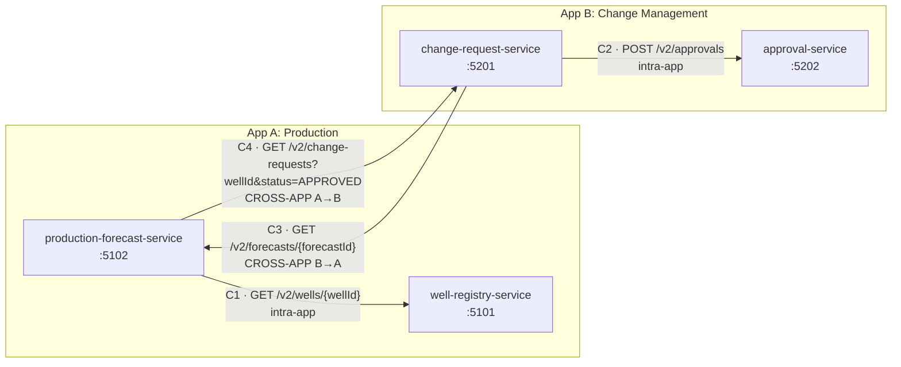
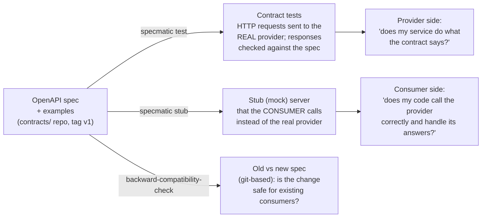

# Specmatic Prototype — Contract Testing Evaluation

> Status: **All phases complete (0–8).** Recommendation: **Conditional Go** (§10), with conditions such as the Docker licence confirmed by IT, an image security scan, and a pilot with 10 green runs on the real agent. Evidence: the [sample report](evidence/sample/index.html) from one command (Phase 8a); contracts `v1.2`.
> New readers: start with [docs/APPLICATION-GUIDE.md](docs/APPLICATION-GUIDE.md), a plain-language guide to the design, folders, services and contracts.
> Moving to a real project: [docs/real-project-guide.md](docs/real-project-guide.md) covers the system patterns used here and the recommended practices (ownership, versioning, test data, auth, monorepo frontends, pipeline stages, exit criteria).
> See everything at once: run `.\scripts\run-evidence.ps1 -Open`, or open the committed [sample report](evidence/sample/index.html) (instructions below).

## How to run the evidence report

**One command runs every case of Phases 3–7 and writes one HTML report for the whole prototype.**

```powershell
.\scripts\run-evidence.ps1 -Open                       # all cases + the pipeline, about 15 min
.\scripts\run-evidence.ps1 -IncludeBreakDemos -Open    # + 27 live break demos, about 25-45 min in total
.\scripts\run-evidence.ps1 -Only case3,mfe             # debugging: some sections only (marked PARTIAL, exit code 1)
```

- **Prerequisites:** Docker engine running, the image `specmatic/specmatic:2.55.0` pulled, `contracts/` cloned, and `npm ci` done once in `mfe/well-mfe`. The run never installs or downloads anything. If a prerequisite is missing, it reports what is missing and skips what depends on it.
- **What it runs**, in order, continuing after a failure:

  | Section | What runs |
  |---|---|
  | Environment | Versions, pins, contract tag/commit, clean start (ports, leftovers), build |
  | Contracts | `examples validate --examples-to-validate BOTH`, bundle check, compatibility vs `main`, in a fresh clone |
  | Case 1 | well-registry provider tests (examples, then capped resiliency), xUnit unit tests |
  | Case 2 | C1 and C2: provider tests, and consumer tests against strict stubs |
  | Case 3 | C3 and C4: provider ContractTests with the other app mocked, and consumer tests against strict stubs |
  | Case 4 MFE | C5 provider side, client generation, `ng build`, Playwright against a strict stub |
  | Pipeline | `run-all.ps1`: each gate and the DeployDev decision |
  | Break demos (`-IncludeBreakDemos`) | Phases 3–7 demos applied live **in a throwaway copy under `%TEMP%`**, each with its expected and actual result |
  | Clean-up and integrity | Everything stopped; both repos unchanged (file list **and** content fingerprint); copy deleted; `node_modules` intact |
- **Report layout (for reviewers):**
  - an **executive summary**: verdict, key figures, and what the run demonstrates;
  - **the approach under evaluation**: from the contract repository through the PR gate and service pipeline to deployment;
  - **interactions under contract**: each consumer → provider pair verified on both sides, with the provider's API coverage;
  - **known limits** and the test layer that covers each one, linked to the break demo that shows it;
  - then the detailed evidence, with a direct **"Specmatic report ↗"** link on each Specmatic check.

  **Print / Save as PDF** produces a handout. The narrative text lives in [scripts/evidence/plan.psd1](scripts/evidence/plan.psd1), so it can be edited without touching code.
- **Output:**
  - `evidence/latest/index.html` is one self-contained file (inline CSS/JS, no external links), which opens offline by double-clicking;
  - every run is kept in `evidence/history/<yyyy-MM-dd_HHmm>/` (report, `evidence.json`, raw reports), and the last 10 runs are kept;
  - both folders are git-ignored. The committed **[evidence/sample/index.html](evidence/sample/index.html)** shows what the report looks like. GitHub shows `.html` files as source, so clone the repo and open it locally.
- **Exit code** is 0 only when every check passed **and** every break demo behaved as expected (with `-IncludeBreakDemos`).
- **Data sources:**
  - JUnit XML from Specmatic and Playwright;
  - TRX from `dotnet test` (built in, so no extra logger package; raw TRX files are never linked, because they contain the user and machine name);
  - Specmatic's coverage table from the console output (the free edition has no coverage JSON).
- **Privacy:** paths are shown relative to the repo root, and user, host and temp paths are removed.
- The scripts it reuses write to `evidence/history/<run>/raw/` through `PROTO_RESULTS_DIR`, so the committed `results/` folder is never touched.
- **How it is built:**
  - [scripts/run-evidence.ps1](scripts/run-evidence.ps1) orchestrates the run;
  - [scripts/evidence/plan.psd1](scripts/evidence/plan.psd1) is the run plan: what each section proves, and every break demo with its expected outcome;
  - [Evidence.psm1](scripts/evidence/Evidence.psm1) holds the parsers and clean-up;
  - [Build-Report.ps1](scripts/evidence/Build-Report.ps1) and [report-template.html](scripts/evidence/report-template.html) render the report;
  - only PowerShell and browser built-ins are used, with no new packages.

## 0. Master checklist
Ticked items link to their evidence. Updated at the end of every phase.

**Phase 0–2 (done)**
- [x] Environment checked, Specmatic 2.55.0 pinned, help outputs saved: [results/phase0/](results/phase0/)
- [x] Git/GitHub setup: 2 independent repos (prototype + contracts), MIT licence, repo-local identity, first pushes after scan + approval ([§2 Repositories](#repositories))
- [x] 4 services, fixed ports, call map C1–C4, no loops, `/v2` paths, health endpoints ([§3](#3-architecture-diagram-ports-and-call-map))
- [x] Smoke test 17/17: [results/phase2/smoke-test.txt](results/phase2/smoke-test.txt)
- [x] 4 OpenAPI specs, common ProblemDetails, 17 inline + 9 consumer examples, `consumers.yaml`, examples validate passes, contracts tag `v1` pushed: [results/phase2/examples-validate.txt](results/phase2/examples-validate.txt)
- [ ] OPEN: Docker Desktop licence confirmed with IT (plan shows Personal); otherwise switch to the JAR route. Still open at the end of Phase 8: it is **condition 1** of the recommendation (§10) and scorecard row 18

**Phase 3: Case 1 (well-registry)**
- [x] First examples-only run: 8 passed, 6 skipped, 40% API coverage: [results/demo/specmatic-test-console.txt](results/demo/specmatic-test-console.txt)
- [x] Copy all reports (console, JUnit, HTML, coverage) to `results/case1/`; `contracts/` now mounted read-only: [results/case1/03-all-examples/](results/case1/03-all-examples/) (`console.txt`, `coverage.txt`, `junit/`, `build/.../html/index.html`, `summary.json`)
- [x] 400 and 401 examples: a missing header gets the token injected (test fails), an INVALID token works, an EMPTY header works as "no token"; coverage 40% → 100%: [02-error-examples](results/case1/02-error-examples/), [02b-empty-auth-header](results/case1/02b-empty-auth-header/), [03-all-examples](results/case1/03-all-examples/)
- [x] Resiliency run: uncapped 7,346 tests (collapsed on the Docker DNS timeout); capped 36 tests (19 negative), all passing, 100%: [04-resiliency](results/case1/04-resiliency/), [04b-resiliency-capped](results/case1/04b-resiliency-capped/)
- [x] xUnit project (13 tests) for endpoint → service → repository; what Specmatic cannot see explained in §5 Phase 3b: [results/case1/05-xunit-baseline.txt](results/case1/05-xunit-baseline.txt), [nuget-restore.txt](results/case1/nuget-restore.txt)
- [x] Break experiments 01–07, one at a time, rerun, recorded, reverted (checksums identical): [results/case1/break/summary.md](results/case1/break/summary.md)
- [x] Extra experiments 08 (new field, closed schema → caught) and 09 (`additionalProperties: true` → not caught)
- [x] Results table in README §6
- [x] Commit Phase 3 (including `results/demo` and `contracts/.gitignore`); contracts tagged `v1.1` (examples added, backward compatible); pushed

**Phase 4: Case 2 (intra-app, C1 and C2)**
- [x] Provider tests for well-registry (15/15, 100%) and approval (6/6, 43%): [results/case2/provider-c1-well-registry/](results/case2/provider-c1-well-registry/), [provider-c2-approval](results/case2/provider-c2-approval/)
- [x] Stubs on 9101 / 9202 (strict, under `/v2`); 11 consumer xUnit tests against the stubs pass: [results/case2/](results/case2/)
- [x] Stub rejects contract-violating consumer requests (bad id pattern, bad enum, wrong path, renamed request field)
- [x] Example-driven stub responses: happy path, SHUT_IN, 404, approve/reject (the empty list is a C4 example, exercised in Phase 5)
- [x] T4: stubs served under `/v2` via mock config `baseUrl` (§5 Phase 4, finding 1)
- [x] T5: exact token asserted in consumer tests with a recording handler; the stub only checks format (experiment 03)
- [x] Mitigation for random stub data: strict stubs + an example for every consumer scenario
- [x] Break experiments on both consumer and provider sides: 6/6 caught: [results/case2/break/summary.md](results/case2/break/summary.md)
- [x] Pact comparison: what is covered, what isn't, how examples + `consumers.yaml` close the gap (§5 Phase 4)
- [x] Application guide (design, folders, services, specs, terms, reasons): [docs/APPLICATION-GUIDE.md](docs/APPLICATION-GUIDE.md)
- [x] Real-project guide (system patterns used, best practices for a real project): [docs/real-project-guide.md](docs/real-project-guide.md)
- [x] Commit Phase 4 and push (after scan + approval)

**Phase 5: Case 3 (cross-app, C3 and C4)**
- [x] Provider (5/5, 7/7, dependencies mocked) and consumer (8/8 vs strict stubs) tests for C3 and C4, specs from the contracts **git** repo: [results/case3/](results/case3/)
- [x] Backward-compatibility check: optional field PASS (exit 0), renamed required field FAIL (exit 1): [results/case3/compat/](results/case3/compat/)
- [x] T1: the free edition **fails** (exit 1) on a breaking change, so oasdiff is not needed
- [x] T1 follow-up: a breaking change on an endpoint with **no consumer examples** also fails (exit 1); "usages" = Insights data: [05-breaking-no-consumer-examples-vs-main](results/case3/compat/05-breaking-no-consumer-examples-vs-main/console.txt)
- [x] Compared against tags `v1` and `v1.1` as well as `main`
- [x] Drift both ways: provider drift caught only by the provider test (consumer stays green, real call gives 502); contract drift rejected against the consumer's examples: [results/case3/drift/](results/case3/drift/)
- [x] Commit Phase 5 and push (after scan + approval): root `5f369a3`
- [x] Throwaway contracts clone deleted after its evidence was saved (incl. [experiment-branches.diff.txt](results/case3/compat/experiment-branches.diff.txt))

**Tracked items (status)**
| # | Item | Status | Evidence |
|---|---|---|---|
| T1 | Compatibility check fails or only warns without Insights? | ✅ **Resolved: fails (exit 1)**, also for endpoints without consumer examples; oasdiff not needed | [results/case3/compat/](results/case3/compat/) |
| T2 | Bundled OSS licence expires 14 Dec 2027 | ✅ **Recorded** in the scorecard (§9 row 17) and as condition 6 of the recommendation; it remains a lifecycle risk to plan for | [results/phase0/show-license.txt](results/phase0/show-license.txt) |
| T3 | Never commit to the parent home-folder repo | ✅ held in every phase (both repos are their own git roots) | §2 Repositories |
| T4 | Stubs under `/v2` like the real services | ✅ **Resolved**: v3 mock config `baseUrl: http://0.0.0.0:9000/v2` (CLI alone serves at the root) | `specmatic/*.mock.yaml`, §5 Phase 4 finding 1 |
| T5 | Prove the consumer sends the correct token | ✅ **Resolved with a documented workaround**: the stub only checks the `Bearer` format (and skips the check for example matches), so the exact token is asserted by a recording handler in each consumer's tests | [case2 experiment 03](results/case2/break/03-consumer-wrong-auth-scheme/consumer-tests.txt), §5 Phase 4 finding 2 |

**Phase 6: Angular MFE consumer**
- [x] Minimal Angular CLI app: Angular **21.2.24/21.2.25** via `npx` (no global install), exact pins, approved installs (423 packages, 223 MB; Chromium reused, 0 MB): [mfe/well-mfe/](mfe/well-mfe/)
- [x] TypeScript client generated from the well-registry spec (ng-openapi-gen 1.1.0 + a bundling step for external `$ref`s), regenerated on every build/start
- [x] Contract break shows up as a compile error (`TS2551: Property 'dailyCapacityBbl' does not exist on type 'Well'`): [results/case4-mfe/compile-break/build.txt](results/case4-mfe/compile-break/build.txt)
- [x] Playwright (4/4) against a strict Specmatic stub via the dev-server proxy: example list, example-driven empty list, documented 400 example, and a contract-violating request rejected by the stub: [results/case4-mfe/e2e/](results/case4-mfe/e2e/)
- [x] MFE consumer examples (`well-mfe__*`, C5) added to the contract repo and verified by the **provider** tests (17/17): [provider-well-registry-with-mfe-examples](results/case4-mfe/provider-well-registry-with-mfe-examples/); contracts tagged `v1.2`
- [x] Why HttpTestingController bypasses the stub; recommended MFE test approach (§5 Phase 6)
- [x] CORS/proxy findings ([cors-check.txt](results/case4-mfe/cors-check.txt)) and effort per MFE (§5 Phase 6)
- [x] Fixed a v1.1 example that `examples validate` rejected (empty `Authorization` → `Bearer ` with an empty token): [provider-401-bearer-empty](results/case4-mfe/provider-401-bearer-empty/)
- [x] Commit Phase 6 and push (after scan + approval): root `e6c0e17`, contracts `26a7894` + tag `v1.2`

**Phase 7: Pipeline simulation (two pipelines)**
- [x] xUnit "ContractTests" project per provider (4), each starting its service (+ dependency mocks) and running Specmatic; plain `dotnet test`
- [x] Contracts PR pipeline: `scripts/contracts-pr-check.ps1` + [pipelines/contracts-pr-pipeline.yml](pipelines/contracts-pr-pipeline.yml): validate specs + examples → bundle check → compatibility vs `main`; merge blocked on any failure; no deploy
- [x] Service pipeline: `scripts/run-all.ps1` + [pipelines/azure-pipelines.yml](pipelines/azure-pipelines.yml): one BuildService stage (7 gates incl. the Angular steps), DeployDev `dependsOn: BuildService`; green run in 4.3 min: [results/pipeline/green/](results/pipeline/green/)
- [x] A deliberate failure for each gate type, with the gate that stopped it: [results/pipeline/failure-demos.md](results/pipeline/failure-demos.md)
- [x] Generic sample YAML (placeholders only); pinned .NET SDK (`global.json`) and Node (`.nvmrc`) versions
- [x] README notes: version pinning, deprecating an endpoint, JAR route for agents without Docker (§5 Phase 7)
- [x] Commit Phase 7 and push (after scan + approval): root `97e5a2e` (pipelines, demos) and `1480c69` ([docs/real-project-guide.md](docs/real-project-guide.md))

**Phase 8a: One-command evidence run with a unified HTML report**
- [x] `scripts/run-evidence.ps1 [-IncludeBreakDemos] [-Open] [-Only …]`: every case of Phases 3–7 from a clean start, continuing after failures; one self-contained HTML report ([sample](evidence/sample/index.html)); see "How to run the evidence report" at the top
- [x] Break demos (27) run live in a throwaway copy under `%TEMP%`; both repos verified unchanged at the end
- [x] Verification runs (§5 Phase 8a):
  - run 1 without demos: PASS, 13.2 min;
  - run 2 with demos: FAIL, 26/27, a PowerShell 5.1 quoting defect in a script, found and fixed;
  - run 3 with demos: PASS, 27/27, 25.4 min;
  - run 4 on the clean committed tree: PASS, 27/27, 36.7 min. The committed sample is rendered from this run.
- [x] Shell guidance (pin `bash:`/`pwsh:`, JSON through files, same shell locally) in the real-project guide §3.8 and the limitations table; sample YAMLs use `bash:` everywhere, and an invalid-YAML bug in the Phase 7 sample is fixed
- [x] Commit "Phase 8a: unified evidence report" and push (after scan + approval): root `f23824b`

**Phase 8: Evaluation**
- [x] Coverage section, which says API coverage is not code coverage: well-registry 100 %, the other providers 36–43 %, with the cause and the fix (§7)
- [x] Control points, each with a team owner (QA / developers / DevOps): 19 control points, each linked to its evidence (§8)
- [x] Scorecard, every row linked to a section of the [evidence report](evidence/sample/index.html) (§9). It covers Angular MFE support, OSS licence expiry (T2), Docker licence (open), cost (zero paid licences), and the security scan of the image (open, needs IT approval)
- [x] Limitations: SignalR/SSE, in-process calls, weak stub auth, `/v2` handling, closed schemas, commercial-only features, plus the Windows findings (§10)
- [x] Recommendation: **Conditional Go**, with 7 conditions and the No-Go triggers (§10)
- [x] "Rerun from scratch" section complete (§11, including the one-command evidence run)
- [x] Final commit and push (after scan + approval)

**Always**
- [ ] T3: never commit to the parent home-folder repo (checked at every commit)
- [ ] Scan before every push and wait for approval

## 1. Purpose and scope
Evaluate whether **Specmatic (open-source edition)** fits contract testing for an enterprise stack: Angular MFEs, .NET 10 microservices, Azure DevOps pipelines and OAuth2.
The prototype uses two small "applications" with four services: App A Production (oil & gas) and App B Change Management. Calls go both within an app and across apps. A minimal Angular app acts as an MFE consumer.
The output is evidence for a **Go / Conditional Go / No-Go** decision.

Out of scope: production-grade code, a real OAuth2 identity provider, and a full MFE shell (Module Federation). Phase 6 uses one plain Angular CLI app as the MFE stand-in.

### Phase plan
| Phase | Title | Status |
|---|---|---|
| 0 | Environment check | ✅ done |
| 1 | Project structure and design | ✅ done |
| 2 | Contracts (specs, examples, `consumers.yaml`, tag `v1`); services moved under `/v2` with `/liveness` and `/readiness` | ✅ done |
| 3 | Case 1: a service's own API (provider tests, reports, xUnit for the internal layer, break experiments) | ✅ done |
| 4 | Case 2: service-to-service within an app, both directions (provider tests + consumer tests against stubs) | ✅ done |
| 5 | Case 3: cross-application, both directions, specs from the central `contracts/` repo; backward-compatibility check against `v1`; drift | ✅ done |
| 6 | **Minimal Angular MFE consumer**: generated TypeScript client from the spec, contract break as a compile error, Playwright against a Specmatic stub via the dev-server proxy | ✅ done |
| 7 | Pipeline simulation: `run-all.ps1` + sample `azure-pipelines.yml` (**BuildService** stage with unit tests, xUnit `ContractTests` projects and the Angular steps; the deploy stage depends on it), plus the contracts PR pipeline | ✅ done |
| 8a | One-command evidence run (`run-evidence.ps1`) with a unified HTML report; break demos live in a throwaway copy | ✅ done |
| 8 | Evaluation: coverage, control points, scorecard (incl. "Angular MFE consumer support"), limitations, recommendation | ✅ done: **Conditional Go** |

## 2. Environment and versions
Checked on 2026-09-28 (Windows 11 Pro 10.0.26200).

| Tool | Required? | Found version | Status | Action needed |
|---|---|---|---|---|
| .NET SDK | Yes | 10.0.101 (also 9.0.307) | OK | None |
| git | Yes | 2.53.0.windows.1, user.name/user.email configured globally | OK | Optional: global email is personal; set a repo-local identity in `contracts/` if needed |
| Docker Desktop | Yes (chosen route) | Client/Engine 28.3.3, engine running (WSL2) | OK technically | **Licence to be confirmed with IT** (see below) |
| Java | Only for JAR fallback | Oracle JDK 21.0.10 LTS | OK (17+) | None |
| Node.js / npm | Optional | 22.19.0 / 10.9.3 | OK | None |
| PowerShell | Yes | Windows PowerShell 5.1 (execution policy RemoteSigned for the current user) | OK | Scripts are written for 5.1 |
| VS Code C# extensions | Recommended | None installed (only Claude Code, Playwright) | Missing, not blocking | Optional: `ms-dotnettools.csdevkit` |
| **Specmatic** | Yes | **2.55.0** Docker image `specmatic/specmatic:2.55.0` (digest `sha256:422f8796…`) | Installed | None |

**Network:** Docker Hub, Maven Central, NuGet, docs.specmatic.io and GitHub are all reachable directly (no corporate proxy is active).

**Docker Desktop licence:** the organisation has not pushed any Docker admin policy. Docker's terms require a paid seat for commercial use at large organisations, so this **must be confirmed with IT**. If Docker is not allowed, the fallback is Java 21 plus a standalone Specmatic JAR. Note that the Maven Central `specmatic-executable` JAR is a 0.4 MB thin JAR, so the correct standalone download would have to be confirmed first.

**Why Docker:** the image is self-contained, the version is pinned, and the same image runs on Azure DevOps Linux agents. Services run on the Windows host and the container reaches them via `http://host.docker.internal:<port>`. **This was verified in Phase 1** (see `results/phase1/docker-to-host-check.txt`): a service bound only to `localhost` on Windows is reachable from the container, so no firewall change is needed.

**Specmatic licence (important finding):** `show-license` reports a bundled **"Specmatic OSS" licence**, type OSS, rate limit unlimited, **expiry 14 Dec 2027**. The code is MIT on GitHub, but the runtime still checks a licence file baked into the image. Staying on the free edition therefore means upgrading the image before that date. See `results/phase0/show-license.txt`.

**Commands available in 2.55.0** (from `--help`, saved in `results/phase0/`):
`test`, `stub`/`mock`/`virtualize`, `backward-compatibility-check`, `examples`, `proxy`, `config`, `import`, `mcp`. There are also Insights and licence commands (`send-report`, `get-license`, `show-license`) that relate to the paid hosted Specmatic Insights product.

Early observations from the help text (to verify in later phases):
- `test` has `--junitReportDir`, `--filter` (METHOD/PATH/STATUS), `--examples`, `--strict` (no generated tests for endpoints without examples), `--testBaseURL`, `--overlay-file`.
- `backward-compatibility-check` is **git-based**: it compares changed files against `--base-branch` in `--repo-dir`. It does not take two file paths. The older two-file `compare` command is deprecated. Comparing against a **tag** (v1) needs to be tested in Phase 5.
- The `--strict` flag on `backward-compatibility-check` is **"only applicable when using Specmatic Insights"** (paid/hosted). Without it, breaking changes to APIs "that have no usages" produce warnings only. This matters for Phase 5.
- Configuration: the current docs use **`specmatic.yaml` version 3** (`systemUnderTest`, `dependencies`, `components.sources/services/runOptions`). Version 2 (`contracts`, `provides`, `consumes`) is still documented. We add a config file only when a phase needs one.
- Docs marked **commercial-only** (not usable by us): the interactive examples GUI, template values in examples (e.g. `${API_TOKEN:...}`), just-in-time auth tokens via fixtures, detection of competing examples, gRPC and GraphQL mocks. The docs source was read from the public `specmatic/docs.specmatic.io` repo, because the site renders client-side.

### Repositories
The prototype uses **two independent git repositories**. Both use the `main` branch and are MIT licensed.

| Repo | Local folder | GitHub (public) | Contains |
|---|---|---|---|
| Prototype | `./` (root) | `Raghul5823/specmatic-prototype` | services, tests, scripts, results, this README |
| Contracts | `./contracts/` | `Raghul5823/specmatic-prototype-contracts` | OpenAPI specs, shared schemas, examples, `consumers.yaml`, tags `v1`, … |

- The root `.gitignore` excludes `contracts/`, so the two repos never overlap. This simulates a central contract repo that is owned and versioned separately from the service code.
- Specmatic always reads specs from the **local** `contracts/` repo (a git checkout). GitHub is only for backup and sharing, so Specmatic never needs GitHub credentials.
- The machine this runs on has a git repository in a parent folder. The prototype root is its own repository (`git rev-parse --show-toplevel` returns the prototype folder), and nothing is ever committed to the parent repo.
- Committed files contain no local machine paths, secrets or organisation-specific names. Service logs (`*.log`) are not committed because they contain absolute paths.

## 3. Architecture diagram, ports and call map


Arrows point from **consumer → provider**. All business endpoints are under the **`/v2` base path**, matching the ingress route in our real Helm setup. Each service also exposes **`/liveness`** and **`/readiness`** at the root, with no auth; these are not in the contracts (see §4).

### Ports
| Service | App | Port | Planned Specmatic stub port (Phases 4–5) |
|---|---|---|---|
| well-registry-service | A | 5101 | 9101 |
| production-forecast-service | A | 5102 | 9102 |
| change-request-service | B | 5201 | 9201 |
| approval-service | B | 5202 | 9202 |

### Call map
| # | Consumer | Provider | Endpoint | Type | Triggered by | Fields the consumer relies on |
|---|---|---|---|---|---|---|
| C1 | production-forecast | well-registry | `GET /wells/{wellId}` | intra-app (A) | `POST /forecasts` | `id, name, status, dailyCapacityBbl`; 404 = unknown well |
| C2 | change-request | approval | `POST /approvals` | intra-app (B) | `POST /change-requests` | sends `changeRequestId, type, capacityDeltaBbl`; reads `id, decision, reason`; expects 201 |
| C3 | change-request | production-forecast | `GET /forecasts/{forecastId}` | **cross-app B→A** | `POST /change-requests` (only when `forecastId` is given) | `id, wellId`; 404 = unknown forecast |
| C4 | production-forecast | change-request | `GET /change-requests?wellId=&status=APPROVED` | **cross-app A→B** | `POST /forecasts` | `id, wellId, status, capacityDeltaBbl` |

**Why the two-way cross-app calls cannot loop:** each direction uses a different endpoint, and the endpoint being called makes no outbound calls.
- `POST /forecasts` calls `GET /change-requests`, which only reads the in-memory store.
- `POST /change-requests` calls `GET /forecasts/{id}`, which only reads the in-memory store.

The endpoints that fan out (the two POSTs) are never called by another service.

### Endpoint inventory
Every business endpoint requires `Authorization: Bearer test-token-123`. The probes don't.
Paths below are relative to the `/v2` base path (e.g. `GET /wells` is `GET /v2/wells`), the same way the specs write them.

| Service | Endpoint | Success | Errors |
|---|---|---|---|
| well-registry | `GET /wells?status=ACTIVE\|SHUT_IN\|ABANDONED` | 200 list | 400, 401 |
| | `GET /wells/{wellId}` (pattern `W-000`) | 200 | 400, 401, 404 |
| | `POST /wells` | 201 + `Location` | 400, 401 |
| production-forecast | `POST /forecasts` | 201 + `Location` | 400 (validation, unknown or non-ACTIVE well), 401, 502 (downstream failure) |
| | `GET /forecasts/{forecastId}` (pattern `F-0000`) | 200 | 400, 401, 404 |
| change-request | `POST /change-requests` | 201 + `Location` | 400 (validation, unknown forecast or forecast for a different well), 401, 502 |
| | `GET /change-requests?wellId=&status=APPROVED\|REJECTED` | 200 list | 400, 401 |
| | `GET /change-requests/{changeRequestId}` (pattern `CR-0000`) | 200 | 400, 401, 404 |
| approval | `POST /approvals` (rule: `abs(capacityDeltaBbl) <= 500` → APPROVED, otherwise REJECTED) | 201 + `Location` | 400, 401 |
| | `GET /approvals/{approvalId}` (pattern `A-0000`) | 200 | 400, 401, 404 |
| all four | `GET /liveness`, `GET /readiness` (root, **not** under `/v2`, no auth, **not in the contracts**) | 200 | – |

**Seed data** (fixed, so that Phase 2 examples can match it):
- Wells: `W-001` Eagle-1 (ACTIVE, 1200 bbl/d), `W-002` Eagle-2 (ACTIVE, 800), `W-003` Permian-7 (SHUT_IN, 0).
- Forecast: `F-5001` for W-001.
- Change requests: `CR-1001` (W-001, +150, APPROVED) and `CR-1002` (W-001, +900, REJECTED).
- Approvals: `A-7001` and `A-7002`.

### Folder layout
```
Specmatic Prototype/
├─ README.md                      <- this file (main deliverable)
├─ SpecmaticPrototype.sln         <- builds all projects
├─ contracts/                     <- SEPARATE git repo (central contract repo), tagged v1
│   ├─ common/common.yaml         <- shared ProblemDetails + 400/401/404/502 responses
│   ├─ specs/app-a-production/    <- well-registry-service.yaml, production-forecast-service.yaml (+ *_examples/)
│   ├─ specs/app-b-change-mgmt/   <- change-request-service.yaml, approval-service.yaml (+ *_examples/)
│   └─ consumers.yaml             <- who uses which endpoint and fields (our governance file)
├─ shared/Prototype.ServiceDefaults/   <- JSON rules, bearer check, ProblemDetails, HttpClient helper
├─ app-a-production/
│   ├─ well-registry-service/          Program.cs, WellEndpoints.cs -> WellService.cs -> WellRepository.cs
│   └─ production-forecast-service/    ForecastEndpoints.cs -> ForecastService.cs -> Clients.cs / ForecastRepository.cs
├─ app-b-change-mgmt/
│   ├─ change-request-service/         ChangeRequestEndpoints.cs -> ChangeRequestManager.cs -> Clients.cs / Repository
│   └─ approval-service/               ApprovalEndpoints.cs -> ApprovalPolicy.cs -> ApprovalRepository.cs
├─ scripts/                       <- common.ps1, start-services.ps1, stop-services.ps1, smoke-test.ps1 (run-all.ps1 in Phase 7)
└─ results/                       <- evidence per phase (phase0/, phase1/, case1/ ...), logs/
```

### Design decisions (and why they matter for Specmatic)
| Decision | Why |
|---|---|
| **Contract-first:** specs are hand-written in `contracts/`, not generated from code | The central repo is the source of truth. A spec generated from code would just agree with whatever the code does, bugs included. |
| Each service has **endpoint → service → repository** layers behind interfaces | Phase 3b: shows the internal layer that Specmatic cannot see (it only sees HTTP). |
| **Strict JSON:** no numbers-as-strings, no integer enums, no nulls for required fields | Lets Specmatic's negative tests (wrong type, wrong enum value) get a 400, not a silent coercion. |
| Every error is **RFC 9457 ProblemDetails** (`application/problem+json`), including 401 and unknown routes | One error schema that can be put in the spec and checked. |
| **Fixed test token** in `Auth:Token` (middleware); outbound calls send `Downstream:Token` | Stand-in for OAuth2, so we can see how Specmatic supplies the token in test and stub mode. |
| **Consumer DTOs hold only the fields they use** (e.g. `WellSummary` has 4 of the provider's 8 fields); a missing field fails deserialisation and gives a 502 | This mirrors what consumer examples and `consumers.yaml` should record. A provider change to an unused field shouldn't break the consumer. |
| Downstream base URLs come from config and **include the provider's base path** (`http://localhost:5101/v2/`); clients use relative paths (`wells/W-001`). The URL can be overridden by env var (e.g. `Downstream__WellRegistryBaseUrl=http://localhost:9101/`) | Phases 4–5 point a consumer at a Specmatic stub without changing code. A Specmatic stub serves at the root by default (see §4), so for a stub the URL has no `/v2`. |
| Business endpoints under **`/v2`**, probes `/liveness` and `/readiness` at the root without auth | Mirrors our real Helm and ingress setup. |
| Unavailable or unexpected downstream → **502 ProblemDetails** | A consumer's reaction to a provider breaking the contract is visible and testable. |

## 4. How Specmatic works
One OpenAPI spec is used in three ways. Nothing is generated into code: Specmatic reads the spec at runtime.



### 4.1 Spec → test (provider side)
- Specmatic turns each **operation + response** in the spec into test scenarios. It sends real HTTP requests to the running provider and checks the status code, headers and body against the spec.
- **Examples drive the test data.** A parameter or request-body example and a response example with the **same name** (e.g. `GET_W001`) form one test: "send wellId=W-001, expect 200 shaped like `Well`". Consumer-contributed external examples (`*_examples/*.json`) also become provider tests. This is how a consumer's expectation is checked against the real provider.
- Operations without examples still get tests, with values generated from the schema. Negative and generative tests are checked in Phase 3.
- **Observed in 2.55.0 (probe, Phase 2):**
  - **The `servers` URL is ignored.** The base path must go in `--testBaseURL http://host.docker.internal:5101/v2`. Without it, Specmatic called `/wells/W-001` and missed the service.
  - **Auth:** for a `bearer` security scheme, Specmatic sends a **random** token (`Authorization: Bearer LOVWO`) unless one is supplied. That gave 401 and a failed test. Supplying it as an env var named after the scheme (`-e bearerAuth=test-token-123`) worked. `specmatic.yaml` `securitySchemes` is the documented alternative.
  - **Response schemas are treated as closed:** extra response fields fail with `R2003 Unknown property`, even without `additionalProperties: false`. So adding a response field needs a spec change first.

### 4.2 Spec → stub (consumer side)
- `specmatic stub <spec>` starts an HTTP server on port 9000 inside the container (we map it to 9101, etc.). The consumer's base URL is pointed at it.
- **Observed in 2.55.0** (`results/phase2/stub-demo.txt`, well-registry stub):

| Request to the stub | Result | Why |
|---|---|---|
| `GET /wells/W-003` (no token) | 200, the exact `SHUT_IN` well from the consumer example | request matched an external example |
| `GET /wells/W-999` (no token) | 404 ProblemDetails from the consumer example | example-driven error response |
| `GET /wells?status=ACTIVE` (no token) | 200, the two wells from the inline example `LIST_ACTIVE` | inline examples are also stub data |
| `GET /wells/W-555` (no token) | **400**, `Specification expected mandatory header "Authorization"` | no example matched, so the full request was validated |
| `GET /wells/W-555` + `Authorization: Bearer anything` | 200, **random** well (`X-Specmatic-Type: random`, `id: W-307`, `dailyCapacityBbl: 1.3E308`) | generated from the schema; values don't echo the request, and there is no `maximum` |
| `GET /wells/WELL-1` + token | **400**, `R1003 ... matches regex ^W-\d{3}$` | contract violation (path pattern) |
| `GET /wells?status=PUMPING` + token | **400**, `R1002 ... expected ("ACTIVE" or "SHUT_IN" or "ABANDONED")` | contract violation (enum) |

- **What to notice:**
  - **The stub validates the consumer's request.** A wrong parameter or missing header is rejected with a readable reason, so a consumer that calls the provider wrongly fails its own tests.
  - **The stub checks that a token is present, not its value.** Any bearer value is accepted, and requests that match an example are served even **without** a token. Stubs therefore don't prove that the consumer sends the right token.
  - **Stub rejections use `text/plain`, not ProblemDetails.** A consumer test sees "400 with a non-contract body", which is fine for spotting a broken call.
  - **Random data can be extreme** (1.3E308). Consumers relying on realistic values need examples, or `maximum` in the schema.
  - **The stub serves at the root (`/wells`), not `/v2/wells`.** `servers` is ignored here too. Either point the consumer at `http://localhost:9101/` or configure a mock `basePath`; Phase 4 tries the latter.

### 4.3 Backward-compatibility check
`backward-compatibility-check` compares the changed spec files in a **git** repo (`--repo-dir`) against a base branch (`--base-branch`). It reports whether existing consumers would break, e.g. a removed field, a new required request field or a narrowed enum. Phase 5 runs it against tag `v1`. Tracked item T1 checks whether it **fails** or only **warns** without Insights.

### 4.4 Examples: two kinds, one validator
| | Inline named examples | External examples (`<spec>_examples/*.json`) |
|---|---|---|
| Where | inside the spec (`examples:` with matching names) | separate JSON files: `{"http-request": …, "http-response": …}` |
| Who writes them | provider team | **consumer teams** (file name starts with the consumer, e.g. `production-forecast__…`) |
| Used as | provider tests + stub responses | provider tests + stub responses |
| Validated by | `specmatic examples validate --spec-file <spec> --examples-to-validate BOTH` | same |

`examples validate` found all 26 examples valid (17 inline + 9 external). A deliberately broken example (enum `PUMPING`, missing `dailyCapacityBbl`) was rejected with exit code 1 (`results/phase2/examples-validate-broken-example.txt`). By default it checks **only external** examples; add `--examples-to-validate INLINE|BOTH`. It also requires values for **required response headers** in examples (e.g. `Location`).

### 4.5 Why `/liveness` and `/readiness` are left out of the contracts
- **Different audience:** probes are for the orchestrator (the Kubernetes kubelet), not for API consumers. No service or MFE calls them, so there's no consumer to protect.
- **Different lifecycle:** probes stay at the root (no `/v2`), have no auth and change with platform conventions, not API versions. In a `/v2` spec they would be wrong, or would need exceptions.
- **Noise in testing and coverage:** in a spec, Specmatic would generate tests and count coverage for them. Stubs would also serve fake "UP" answers that mean nothing.
- **Where they're checked instead:** by deployment and smoke tests (`scripts/smoke-test.ps1` checks both return 200 without a token) and by the Helm chart's probe config. If an app framework exposes such routes, Specmatic's `filter` (e.g. `PATH!='/liveness,/readiness'`) keeps them out of test runs.

## 5. Phase-by-phase log

### Tracked items
| # | Item | Checked in | Status |
|---|---|---|---|
| T1 | Does `backward-compatibility-check` **fail** (non-zero exit code) or only **warn** on a breaking change without Insights? If it only warns, record that and test **oasdiff** (free) as an alternative compatibility gate. | Phase 5 | ✅ fails (exit 1), also without consumer examples; oasdiff not needed |
| T2 | The bundled OSS licence expires **14 Dec 2027**. Record it as a maintenance risk. | Phase 8 scorecard | ✅ recorded (§9 row 17, condition 6 in §10) |
| T3 | **Never commit to the git repo in the parent folder.** Only the prototype repo and `contracts/` are committed, each to its own GitHub repo, and pushes happen only after approval. | All phases | ✅ held so far |
| T4 | Stub base path: try a mock `basePath`/`baseUrl` so stubs serve under `/v2`, like the real services. | Phase 4 | ✅ resolved (mock config `baseUrl`) |
| T5 | Stub auth is weak: a token must be present but any value passes, and example matches skip the check. Decide how consumer tests should prove that the right token is sent. | Phase 4 | ✅ workaround: recording handler in consumer tests |

### Phase 0 — Environment check
- **Done:** read-only checks of the tools, network and proxy, and published Specmatic versions (Docker Hub, Maven Central and GitHub all show 2.55.0 as latest, released 2026-09-24).
- **Installed (with approval):** `docker pull specmatic/specmatic:2.55.0` (522 MB on disk).
- **Commands run:**
  ```powershell
  docker run --rm specmatic/specmatic:2.55.0 --version
  docker run --rm specmatic/specmatic:2.55.0 --help
  docker run --rm specmatic/specmatic:2.55.0 test --help
  docker run --rm specmatic/specmatic:2.55.0 stub --help
  docker run --rm specmatic/specmatic:2.55.0 backward-compatibility-check --help
  docker run --rm specmatic/specmatic:2.55.0 show-license
  ```
- **Produced:** `results/phase0/*.txt`.
- **What to notice:** the free edition has an expiring bundled licence; the compatibility check depends on git; and some flags only work with Insights (the paid product).

### Phase 1 — Project structure and design
- **Done:**
  - Created 4 minimal-API services (net10.0) and a shared defaults library, all in `SpecmaticPrototype.sln`.
  - Added PowerShell scripts to start, stop and smoke-test the services.
  - Ran `git init -b main` inside `contracts/`; nothing is committed yet (commit + tag `v1` in Phase 2).
- **Nothing installed:** `dotnet new web` / `dotnet new sln` use only the SDK, and no NuGet packages are referenced.
- **Commands run:**
  ```powershell
  dotnet new web -n WellRegistryService -o app-a-production\well-registry-service -f net10.0   # x4
  dotnet new sln -n SpecmaticPrototype ; dotnet sln add ...                                    # 5 projects
  dotnet build SpecmaticPrototype.sln            # 0 warnings, 0 errors
  .\scripts\start-services.ps1 ; .\scripts\smoke-test.ps1 ; .\scripts\stop-services.ps1
  docker run --rm --entrypoint curl specmatic/specmatic:2.55.0 -s -i -H "Authorization: Bearer test-token-123" http://host.docker.internal:5101/wells/W-001
  git -C contracts init -b main
  ```
- **Produced:**
  - `results/phase1/smoke-test.txt`: **14/14 passed**. Covers happy paths, 401 without a token, 400 ProblemDetails with per-field `errors`, a string sent for a number rejected with 400, 404 ProblemDetails, and both cross-app chains. `POST /forecasts` for W-001 gives effective capacity 1350 = 1200 + approved CR-1001 (+150).
  - `results/phase1/docker-to-host-check.txt`: HTTP 200 from inside the Specmatic container.
- **What to notice:**
  - The two cross-app directions use different endpoints (C3 vs C4), so they cannot loop.
  - A malformed body (wrong JSON type) returns a generic 400 ProblemDetails with no `errors` map. A well-formed body with missing or invalid fields returns 400 with an `errors` map. Both are ProblemDetails, so the spec's 400 schema must make `errors` optional.

### Git and GitHub setup (between Phases 1 and 2)
- Initialised the root repo; `.gitignore` excludes `bin/ obj/ .vs/ node_modules/ *.log contracts/`. Added an MIT `LICENSE` to both repos.
- Set a repo-local identity and `origin` remote in both repos. GitHub sign-in is done by the user through the Git Credential Manager browser prompt; no tokens are stored.
- Before each push: a scan for secrets, personal details, machine paths and organisation names, then the list of files, then user approval. The first commit (Phase 0–1) was pushed with approval.

### Phase 2 — Contracts
- **Service changes first** (to match our real Helm setup):
  - All business endpoints moved under **`/v2`**. Consumer clients now use relative paths, with base URLs such as `http://localhost:5101/v2/`.
  - Added **`/liveness`** and **`/readiness`** (no auth) to every service.
  - `start-services.ps1` now waits on `/readiness`.
  - Smoke test rerun: **17/17 passed**, including "old path without `/v2` → 404" and both probes without a token (`results/phase2/smoke-test.txt`).
- **Contracts written** in `contracts/`:
  - `common/common.yaml`: the ProblemDetails schema (`type`, `title`, `status` required; **`errors` optional**; `traceId` listed because response schemas are treated as closed) and shared 400/401/404/502 responses. It is referenced from every spec with an external `$ref`, which Specmatic resolved without problems.
  - 4 OpenAPI 3.0.3 specs with:
    - `servers: /v2` and a global `bearerAuth` security scheme;
    - strict schemas: required fields, `pattern` for ids, `enum` for statuses, min/max ranges, `format: date` / `date-time`;
    - 400/401/404 (and 502 for the two POSTs that call other services), and a required `Location` on every 201;
    - 17 named inline examples that match the seed data.
  - 9 consumer-contributed external examples (file names start with the consumer), covering happy paths, 404s, an empty list, a `SHUT_IN` well, and approve/reject.
  - `consumers.yaml`: interactions C1–C4 with the operations, responses and fields each consumer uses and the examples it owns. Specmatic doesn't read this file.
- **Commands run:**
  ```powershell
  # validate every spec + all examples (runs inside the contracts/ repo)
  docker run --rm -v "${PWD}\contracts:/usr/src/app" -w /usr/src/app specmatic/specmatic:2.55.0 `
    examples validate --spec-file specs/app-a-production/well-registry-service.yaml --examples-to-validate BOTH   # x4
  # stub demo
  docker run -d --name demo-stub -p 9101:9000 -v "${PWD}\contracts:/usr/src/app" -w /usr/src/app `
    specmatic/specmatic:2.55.0 stub specs/app-a-production/well-registry-service.yaml
  git -C contracts commit ... ; git -C contracts tag -a v1 -m "Contracts v1"
  ```
- **Produced** (`results/phase2/`):
  - `smoke-test.txt`
  - `examples-validate.txt`: 4/4 specs valid, 26/26 examples.
  - `examples-validate-broken-example.txt`: a broken example caught, exit 1.
  - `stub-demo.txt`: example-driven responses, a generated response, and the stub rejecting contract-breaking requests.
- **What to notice:**
  1. **`servers: /v2` is only documentation for Specmatic**, in both test and stub mode (§4.1, §4.2).
  2. **The first real contract bug was caught by the validator, not by a test:** a required `Location` header without an example value.
  3. **Consumer examples do two jobs:** they are stub data for the consumer *and* contract tests for the provider (Phases 3–5). This is what brings Specmatic close to consumer-driven testing.
  4. **Weak stub auth (T5):** the stub proves a token is *present*, not that it is *correct*.

### Phase 3 — Case 1: a service's own API + the internal boundary (well-registry)

**New tooling**
- `scripts/run-provider-test.ps1 -Service <name> -Out <folder> [-Config <specmatic.yaml>] [-Env @{..}] [-ExtraArgs ..]` runs Specmatic against a running service. It:
  - saves **every** report into `results/<folder>/`: `console.txt` (all requests and responses), `coverage.txt`, `junit/*.xml`, `build/reports/specmatic/test/html/index.html` and `summary.json`;
  - mounts `contracts/` **read-only**, so no report can land in the contract repo again;
  - adds `--add-host host.docker.internal:host-gateway` (see the network finding below).
- `specmatic/well-registry.specmatic.yaml`: the provider's **v3 config**. It lives with the service, reads the spec from the contracts folder (`filesystem` source) and turns on `schemaResiliencyTests: all`. `specmatic config validate --input=<file>` says it is valid. (Note: `config validate` uses `--input`, while `test` uses `--config`.)
- `scripts/break-experiment.ps1` and `scripts/case1-break-experiments.ps1`: apply one change, build, run xUnit **and** Specmatic, record the result, revert. Checksums before and after prove the revert.

**3a. Provider contract tests: four runs**

| Run | What changed | Tests | Passed | API coverage | Evidence |
|---|---|---|---|---|---|
| 01 baseline | inline + consumer examples only | 8 | 8 | **40%** | [results/case1/01-baseline/](results/case1/01-baseline/) |
| 02 | + 400 and 401 examples (one with **no** `Authorization` header) | 13 | 12 | 80% | [results/case1/02-error-examples/](results/case1/02-error-examples/) |
| 03 | no-token example changed to an **empty** header; 401 examples for all 3 operations | 15 | 15 | **100%** | [results/case1/03-all-examples/](results/case1/03-all-examples/) |
| 04 | + `schemaResiliencyTests: all`, **no cap** | 7,346 | 158 (+1 failed, 7,187 errors) | 10% | [results/case1/04-resiliency/](results/case1/04-resiliency/) |
| 04b | + resiliency, `MAX_TEST_REQUEST_COMBINATIONS=1`, `--timeout-in-ms=30000`, `--add-host` | **36** (17 positive, **19 negative**) | **36** | **100%** | [results/case1/04b-resiliency-capped/](results/case1/04b-resiliency-capped/) |

**Report formats produced (all free):** console text, the coverage table (`coverage.txt`), JUnit XML (`--junitReportDir`) and HTML (`build/reports/specmatic/test/html/index.html`, written to the **working directory**). CTRF JSON is commercial-only.

**Findings**
1. **Auth in examples (free edition):**
   - An example **without** an `Authorization` header still gets the configured token added (`Bearer test-token-123`). The service then returns 200 and the "expect 401" test **fails**.
   - An example with an **explicit invalid** token (`Bearer wrong-token`) works.
   - An example with an **empty** header (`"Authorization": ""`) also works and stands in for "no token". *(Correction in Phase 6: `examples validate` and the stub reject an empty header because the scheme requires the `Bearer` prefix. Since v1.2 the example sends `"Bearer "` with an empty token, which is valid everywhere and still gives 401.)*
   - So the free edition can test 401 behaviour, but the example must set the header explicitly.
2. **Examples are the main lever for coverage.** Adding 7 provider-owned error examples (`provider__*`) took API coverage from **40% to 100%**. Coverage counts *documented responses that were exercised* (10 here), not code.
3. **Resiliency tests are free and useful, but must be capped.**
   - Uncapped, 3 operations produced **7,346 tests** (every enum value, boundary and type mutation, in combination). That is too many for a pipeline.
   - With `MAX_TEST_REQUEST_COMBINATIONS=1` it ran **36**, including **19 negative tests** generated automatically (null in a required field, an invalid enum `ACTIVE_`, wrong path types, an invalid id pattern, a missing body). All were correctly rejected with 4xx, thanks to the strict JSON settings from Phase 1.
4. **Network finding (this machine):**
   - The uncapped run collapsed: after 158 requests, one request took more than the default **6 s timeout**. Specmatic then reported the server as unreachable and marked the remaining 7,187 tests as **errors**, not failures.
   - Measured cause: from inside a container, resolving `host.docker.internal` took **up to 3.7 s** (a whole request up to 5.4 s). From Windows the same request takes **0.005 s**.
   - Fix: `--add-host host.docker.internal:host-gateway` (lookup then takes 0 s) and a longer `--timeout-in-ms`. On a CI agent with Linux Docker this should not happen, but the timeout is now a documented control point.
5. **Filter syntax:** values must be quoted. `--filter=STATUS=401` fails with "Expected quote"; `--filter="STATUS='401'"` works.
6. **NuGet (side finding):**
   - The machine's global NuGet config includes a private company feed that answered 401, and the first restore failed after 4 minutes.
   - A repo-local `nuget.config` with `<clear/>` plus nuget.org only makes restores reproducible (1.4 s) and keeps internal URLs out of logs.
   - **In the real project, the xUnit package versions should match whatever the team's service repos already use, not the SDK template defaults used here.**

**3b. The internal boundary: xUnit (`app-a-production/well-registry-service.Tests`)**
- Packages pinned to the .NET SDK 10.0.101 template set: xunit 2.9.3, xunit.runner.visualstudio 3.1.4, Microsoft.NET.Test.Sdk 17.14.1, coverlet.collector 6.0.4. Restore evidence: [results/case1/nuget-restore.txt](results/case1/nuget-restore.txt).
- **13 tests, all passing** ([results/case1/05-xunit-baseline.txt](results/case1/05-xunit-baseline.txt)):
  - **repository:** seed data, the status filter, sequential ids;
  - **service:** all missing fields reported at once, coordinate ranges, `NextId()` called **before** `Add()` and `Add()` called exactly once, the filter passed through;
  - **endpoint (hosted in-process, random port):** `GET /v2/wells/W-001` calls `Get(W-001)` **exactly once**; an invalid id or body **never reaches** the repository; a request with no token **touches nothing**; the status filter reaches the repository.
- **What Specmatic cannot see, and why:** Specmatic is a *black-box* tool. It sends HTTP requests from outside the process and checks only what comes back over HTTP (status, headers, body shape). It has no view of:
  - which internal methods ran, how often and in what order (e.g. `NextId()` before `Add()`);
  - whether invalid input was stopped *before* touching data, or rejected only after a write;
  - business rules whose result still has the right *shape* (see break experiment 07);
  - in-process calls between classes, database or cache state, logs and side effects.

  Those belong to xUnit, which the developers own. The two layers complement each other: Specmatic proves the **promise to consumers**, and xUnit proves the **internal behaviour behind it**.

### Phase 4 — Case 2: service-to-service within the same app (C1 and C2)

**New tooling**
- `scripts/stub.ps1 start|stop <service> <port> [-Strict] [-Config <mock.yaml>] [-SaveLogTo <folder>]` runs a Specmatic stub in Docker (`stub-<service>`), with `contracts/` mounted read-only. On stop it can save the stub's request log.
- `specmatic/well-registry.mock.yaml` and `specmatic/approval.mock.yaml` are v3 mock configs with `baseUrl: http://0.0.0.0:9000/v2`.
- Two consumer test projects (same pinned packages, no new downloads):
  - `production-forecast-service.Tests` (C1, 6 tests);
  - `change-request-service.Tests` (C2, 5 tests).

  They use the consumer's **real** typed client, registered with the same `AddDownstreamClient` call as in `Program.cs`, pointed at the stub.
- `break-experiment.ps1` gained a **consumer mode**: start a strict stub, then run the consumer tests.
- Docker after the laptop restart: a container starts in **2.4 s** (it was 1–2 minutes), and all 6 experiments took about 3 minutes.

**4a. Provider side** (Specmatic against the real providers)

| Provider | Tests | Result | API coverage | Evidence |
|---|---|---|---|---|
| well-registry (C1) | 15 | 15 passed | 100% | [results/case2/provider-c1-well-registry/](results/case2/provider-c1-well-registry/) |
| approval (C2) | 6 | 6 passed | **43%** (no 400/401 examples yet, the same gap well-registry had before Phase 3) | [results/case2/provider-c2-approval/](results/case2/provider-c2-approval/) |

**4b. Consumer side** (consumer tests vs **strict** stubs under `/v2`): **11/11 passed**: [C1 output](results/case2/consumer-c1-forecast-vs-wellregistry-stub.txt), [C2 output](results/case2/consumer-c2-changerequest-vs-approval-stub.txt), TRX files in `results/case2/`, stub request logs in [results/case2/stub-logs/](results/case2/stub-logs/).

| Test | What it shows |
|---|---|
| Active / SHUT_IN well, approve / reject | **Example-driven responses**: the stub returns exactly the consumer's examples (happy path, SHUT_IN, approve, reject) and the consumer maps them correctly |
| Unknown well → `null` | example-driven **404** (`production-forecast__get_well_W-999_not_found`) |
| Request that breaks the contract | the **stub rejects** `WELL-1` (pattern) and type `BOGUS` (enum) with 400; the client raises |
| Interaction without an example | **strict mode** refuses a valid but unexampled request (`W-555`, `CR-1999`) with 400 instead of random data |
| Token and `/v2` path | a recording handler proves the consumer sends `Bearer test-token-123` to `/v2/...` (T5) |

The "empty list" response belongs to interaction C4 (`production-forecast__list_approved_W-002_empty`) and is exercised in Phase 5.

**Findings**
1. **T4 solved: stubs under `/v2`.** A v3 mock config with `baseUrl: "http://0.0.0.0:9000/v2"` makes the stub serve `/v2/wells/W-003` (200) and reject `/wells/W-003` (400), the same paths as the real service. Consumers point at `http://localhost:9101/v2/` with no special-casing. (The CLI alone, without a config, serves at the root.)
2. **T5: the stub proves a token is present, not that it is right.**
   - Requests that match an example are served without an auth check.
   - Other requests need an `Authorization: Bearer …` header with **any** value.
   - Experiment 03 proved it: a consumer sending `Token …` passed every stub interaction, and only the **token-recording test** in the consumer's xUnit project caught it.
   - Decision: assert the exact token in consumer tests (a recording `DelegatingHandler`, 15 lines, no packages), and keep tokens **out of** the contract examples so the contract doesn't depend on one environment's test token.
3. **Random stub data is avoided with strict mode.** With `--strict` the stub answers only requests that match an example; everything else gets 400. That turns the examples into a **complete record of what the consumer actually calls**: a consumer cannot add a new call without adding an example, or its tests fail.
4. **Stub mode is stricter than test mode when loading examples.** The stub refused to load `provider__get_well_empty_token_401.json` ("Authorization header must be prefixed with Bearer"), while provider tests run it fine. That's harmless (only that example is skipped in the stub), but it shows that **stubs check the token's format, not its value**.
5. **Test logging:** the `junit` logger for `dotnet test` needs an extra NuGet package (not approved). The built-in **TRX** logger works, and Azure DevOps publishes TRX natively, so consumer tests produce `.trx` and Specmatic produces JUnit XML.

**Comparison with Pact (consumer-driven contracts)**

| | Pact | Specmatic (open source), as used here |
|---|---|---|
| Source of truth | the **consumer's tests**: interactions are recorded into a pact file | the **OpenAPI spec** in a central repo (contract-first) |
| What the provider verifies | only the interactions some consumer recorded | **every** operation and response in the spec, plus consumer examples, plus generated negative tests |
| Consumer side | Pact mock server inside the consumer's unit test | Specmatic stub generated from the spec (strict mode recommended) |
| Who uses which field | **automatic**: derived from the consumer's interactions | **manual**: consumer examples + `consumers.yaml` |
| Value checking | matchers can pin values | shape and types only (Phase 3, experiment 07) |
| Versions and "can I deploy?" | Pact Broker / PactFlow with a version matrix | git tags (`v1`, `v1.1`) + backward-compatibility check (Phase 5); no deployment matrix in the free edition |
| Extra infrastructure | a broker (hosted or self-run) | none: a git repo and a Docker image |
| Same artefact for docs, stubs, tests and code generation | no | **yes** (the spec also generates the Angular client in Phase 6) |

**What Specmatic covers that Pact doesn't:** full conformance of the provider to its documented API (not just the parts someone recorded), generated negative and resiliency tests, backward-compatibility checks on the spec itself, and one file that doubles as documentation and the client-generation source.

**What it doesn't cover:** the automatic, always-up-to-date record of exactly what each consumer uses, and a deployment matrix ("is consumer v5 compatible with provider v8 in PROD?").

**How we close the gap:**
1. **Consumer-contributed examples** in the contract repo play the role of pact interactions. The provider runs them in its own tests (e.g. `production-forecast__get_well_W-003_shut_in` runs in well-registry's provider tests), so a provider change that breaks a consumer fails the **provider's** build.
2. **Strict stubs** keep those examples honest: a consumer call without an example fails the consumer's tests, so the examples cannot silently fall behind the consumer's code.
3. **`consumers.yaml`** records who uses which fields, so a provider can see who to talk to before changing something.
4. **Git tags + the backward-compatibility gate** (Phase 5) replace the broker's versioning.

The remaining gap is **discipline**: examples and `consumers.yaml` are maintained by people, so they need an owner and a PR review rule (see §8 Control points).

### Phase 5 — Case 3: cross-application (C3 and C4), compatibility gate, drift

**New tooling**
- **Git source (the central contract repo model):** `specmatic/production-forecast.*.yaml` and `specmatic/change-request.*.yaml` use `components.sources.<name>.git.url: file:///work/contracts`. Specmatic **clones** the contract repo (`Cloning /work/contracts into .specmatic/repos`) and reads the specs from that clone, not from a local copy. Pointing at the local repo keeps GitHub credentials out of Specmatic. In a real pipeline, the `url` would be the central repo's URL.
- **Provider tests with mocked dependencies:** each provider config has a `systemUnderTest` (`type: test`) and `dependencies` (`type: mock`, on fixed ports).
  - **`specmatic test --config` only tests the system under test.** The dependency mocks must be started separately with **`specmatic mock --config`** (same file), which starts *only* the dependencies.
  - `scripts/deps.ps1` does that.
  - This is the realistic pipeline pattern: App A's build cannot run App B's services, so App B is a mock generated from App B's contract.
- `scripts/compat-check.ps1`: Specmatic `backward-compatibility-check` on a git checkout, with exit code capture. `scripts/case3-drift.ps1`: the drift scenarios.
- `run-provider-test.ps1` gained `-PublishPorts` and `-ContractsDir` (test against another checkout, e.g. a branch).

**5a. Cross-app provider tests** (dependencies mocked from the git-sourced contracts)

| Provider | Mocked dependencies (what they served) | Tests | API coverage | Evidence |
|---|---|---|---|---|
| production-forecast (C3) | well-registry `GET /v2/wells/W-001`; **change-request (App B)** `GET /v2/change-requests?wellId=W-001&status=APPROVED` | **5/5** | 38% | [provider-c3-production-forecast](results/case3/provider-c3-production-forecast/) |
| change-request (C4) | approval `POST /v2/approvals`; **production-forecast (App A)** `GET /v2/forecasts/F-5001` | **7/7** (including App A's consumer examples `production-forecast__list_approved_*`) | 36% | [provider-c4-change-request](results/case3/provider-c4-change-request/) |

Coverage is lower than well-registry's 100% because these specs have no 400/401 examples yet; the fix is the same as in Phase 3.

**5b. Cross-app consumer tests** vs strict stubs from the git-sourced contracts: **8/8 passed**.
- **C4** (production-forecast → change-request): approved changes mapped, **empty list** handled (`W-002` → `[]`), unexampled query refused, exact token and query asserted.
- **C3** (change-request → production-forecast): F-5001 mapped, 404 → null, `FC-1` rejected by the stub (pattern), token asserted.

Evidence: [C4](results/case3/consumer-c4-forecast-vs-changerequest-stub.txt), [C3](results/case3/consumer-c3-changerequest-vs-forecast-stub.txt), stub logs in [results/case3/stub-logs/](results/case3/stub-logs/).

**5c. Backward compatibility, T1 answered:** in the free edition, `backward-compatibility-check` **fails with exit code 1** on a breaking change and passes with **exit 0** on a compatible one. It's a real pipeline gate, so **oasdiff is not needed**. It also works against **tags** (`--base-branch v1`), so a team can gate against the last *released* contract. Details are in §6, Case 3.

**Findings**
1. **Compatibility gate works in the free edition (T1 closed).** The report names the exact property and line: *"RESPONSE.BODY.wellId (production-forecast-service.yaml:175:9): the old specification expects property "wellId" but it is missing in the new specification"*. It also writes an HTML report ([04-breaking-vs-tag-v1/html](results/case3/compat/04-breaking-vs-tag-v1/html/index.html)). The `--strict` flag (fail even for APIs with no recorded usage) needs Insights, but the default already failed our breaking change.
2. **The check is driven by git history**, not by two file paths. It looks at the files changed on the current branch versus `--base-branch` (a branch **or tag**). That suits a contract repo where every change is a pull request.
3. **It also scans files that *mention* a changed spec.** `consumers.yaml` was listed as "Specs referring to the changed specs" and checked (harmlessly, as COMPATIBLE), because it contains the spec's path.
4. **Git source with a local repo:** `url` must be a valid URI (`file:///work/contracts`). A bare path works at runtime but fails `config validate`. The docs show no way to **pin a tag** in a git source, so a pipeline should check out the contract repo at the wanted tag and use a `filesystem` source, or accept the default branch.
5. **Windows path-length limit.** Cloning the contracts repo into a deep folder failed with `Filename too long` (consumer example names are long). Use `git config core.longpaths true` on Windows agents, or a short checkout path.
6. **Line endings:** with `core.autocrlf=true`, a Windows checkout has CRLF endings. Specmatic doesn't mind, but scripts that edit specs must allow for it (`git -c core.autocrlf=false clone` for experiments).

### Phase 6 — Minimal Angular MFE consumer (C5: well-mfe → well-registry)

```
Browser (Playwright, Chromium)
   │  http://localhost:4200            Angular dev server (ng serve)
   │  GET /v2/wells?status=…  ───────► dev-server proxy (proxy.conf.json: /v2 → :9101)
   │  Authorization: Bearer …                        │
   │                                                 ▼
   │                                Specmatic stub of well-registry (strict, baseUrl …/v2)
   │                                built from contracts/ (same spec the provider is tested against)
```

**Setup** (every install was approved beforehand; nothing installed globally)

| Step | Command / package | Measured |
|---|---|---|
| Scaffold | `npx -y @angular/cli@21.2.24 new well-mfe --directory mfe/well-mfe --skip-install --skip-git --skip-tests --style=css --routing=false --ssr=false` (analytics off: `NG_CLI_ANALYTICS=false`) | 92 s, files only |
| Dependencies | exact pins in `package.json`; project `.npmrc` with `registry=https://registry.npmjs.org/` and `save-exact=true`; `@angular/*` 21.2.25 (tooling 21.2.24), TypeScript 5.9.3, rxjs 7.8.2, ng-openapi-gen 1.1.0, @playwright/test 1.62.1 | **423 packages, 223 MB, 163 s** |
| Browser | Playwright 1.62.1 uses Chromium build 1234, **already on this machine** | **0 MB** downloaded |
| Clean-up | removed `prettier`, `@angular/router`, `@angular/forms` (unused) and the generated `.vscode/mcp.json` (it runs an *unpinned* `npx -y @angular/cli`) | — |

**What the app is.** One page (`src/app/app.ts`, `app.html`) that lists wells through the **generated** client (`Api.invoke(listWells, …)`). It takes an optional `?status=` from the page URL. An HTTP interceptor (`auth.interceptor.ts`) adds `Authorization: Bearer test-token-123`, standing in for the real OAuth library. The client's base URL `/v2` comes from the contract's `servers` entry.

**6.1 Client generated from the contract**
- `npm run generate:api` bundles the spec and generates the client with ng-openapi-gen, into `src/app/api/`: 5 models, 1 service, typed functions such as `listWells(params: { status?: WellStatus })`.
- `prebuild`/`prestart` run it automatically, and `src/app/api/` is **git-ignored**, so the client is **always regenerated from the current contract** and can never drift from it.
- **Finding:** ng-openapi-gen 1.1.0 **does not resolve external `$ref`s** ("Couldn't resolve reference ../../common/common.yaml#/…"). Every one of our specs uses one, for the shared ProblemDetails responses.
- **Fix:** `scripts/bundle-spec.mjs` (about 50 lines; it uses `js-yaml`, already installed as the generator's dependency, so no new package) copies the shared components into the spec and rewrites the refs before generation. It refuses to overwrite a component name with a different definition.

**6.2 Contract break → compile error** (`scripts/mfe-compile-break.ps1`): the response field `dailyCapacityBbl` is renamed in a *copy* of the spec, the client is generated from it, and the app is built:
```
X [ERROR] TS2551: Property 'dailyCapacityBbl' does not exist on type 'Well'. Did you mean 'dailyCapacity'? [plugin angular-compiler]
```
The build exits with **1**; regenerating from the real contract builds again with exit **0** ([build.txt](results/case4-mfe/compile-break/build.txt)). The MFE team learns about the break at **build time**, before any test runs. This works because new Angular projects have `strict` and `strictTemplates` on, so template expressions are type-checked as well.

**6.3 Playwright against the stub** (`scripts/mfe-e2e.ps1`: starts the strict stub, runs `npm run test:e2e`, stops the stub, copies the JUnit and HTML reports): **4/4 passed** in about 21 s ([results/case4-mfe/e2e/](results/case4-mfe/e2e/): console, JUnit and stub log; the Playwright **HTML report is kept local only**, because it embeds compressed run data that may contain local paths)

| Test | What it shows |
|---|---|
| lists the wells and sends the bearer token | the response comes from the **MFE's own consumer example** (`well-mfe__list_all_wells`); the request is same-origin through the proxy, and carries exactly `Bearer test-token-123` (T5 at browser level) |
| example-driven empty list | `?status=ABANDONED` → `[]` from `well-mfe__list_abandoned_empty` → "No wells match this filter." |
| documented 400 from a provider example | `?status=PUMPING` matches the provider's example `provider__list_wells_bad_status_400`, so the stub returns that **documented ProblemDetails 400** |
| request that breaks the contract is rejected | `?status=DRILLING` (not in the enum, no example): the **strict stub rejects it** with 400 and its reason ("Example expected "PUMPING" but request contained "DRILLING"…"). TypeScript can't stop this, because the value comes from the URL, not typed code |

**6.4 The provider side of C5:** the two `well-mfe__*` examples run in well-registry's provider tests (**17/17**, [evidence](results/case4-mfe/provider-well-registry-with-mfe-examples/)). The frontend's expectations are therefore part of the **backend's** pipeline, which is the same mechanism as for C1–C4.

**6.5 Why Angular unit tests with `HttpTestingController` bypass the stub**
`provideHttpClientTesting()` replaces Angular's HTTP backend with an **in-memory fake**: no request leaves the test, and the test itself decides the answer (`httpMock.expectOne('/v2/wells').flush([...])`). The test therefore proves the component works *with the data the developer assumed*. No contract, stub or provider is involved, so a renamed field or a new required parameter goes unnoticed, unless the change also alters the generated TypeScript types (then the **compiler** catches it, as in 6.2). Those tests are fast and good for UI logic, but they are not contract tests.

**Recommended test approach for real MFEs**

| Layer | Tool | Catches | Runs in |
|---|---|---|---|
| 1. Generated, typed client from the contract (regenerated every build) | ng-openapi-gen (+ bundling) | renamed/removed fields, type changes, changed parameters, **at compile time** | every build |
| 2. Component/unit tests | `HttpTestingController`, flushing **typed** data (`Well[]`), ideally the contract's example JSON files | UI logic: rendering, empty/error states | every build (fast) |
| 3. A few browser tests against a **strict** Specmatic stub via the dev-server proxy | Playwright | wrong paths/parameters/headers at **runtime** (values from URLs, forms, config), handling of documented error responses, the token sent | MFE pipeline, no backends needed |
| 4. MFE consumer examples in the contract repo | `well-mfe__*.json` + `consumers.yaml` | provider changes that would break the MFE, **in the provider's pipeline** | backend pipelines |

**6.6 CORS and proxy findings** ([cors-check.txt](results/case4-mfe/cors-check.txt))
- **With the dev-server proxy** the browser only talks to its own origin (`http://localhost:4200`), so **no CORS** is involved. The Playwright test asserts that. This matches production, where the MFE and APIs usually sit behind the same ingress.
- **The Specmatic stub also supports CORS.** A preflight from `http://localhost:4200` asking for `authorization` gets `Access-Control-Allow-Origin: http://localhost:4200`, `Access-Control-Allow-Credentials: true` and `Access-Control-Allow-Headers: Content-Type, authorization`. GET/POST are CORS-safelisted, so a browser could call the stub directly. We still recommend the proxy, because it needs no CORS configuration on the real services and keeps the same `/v2` relative URLs as production.

**6.7 Effort per MFE (estimate from this prototype)**
- **First MFE (tooling and decisions):** about 1–2 days. That covers choosing the generator, the bundling step, the proxy and Playwright setup, and the CI wiring.
- **Each additional MFE:** about half a day to copy the pattern: `bundle-spec.mjs`, the `generate:api`/`prebuild` scripts, `proxy.conf.json`, `playwright.config.ts`, and the auth interceptor (which already exists in real MFEs). Then, per API interaction, 1–2 consumer examples (about 15 min each) and 1–3 Playwright tests (about 30 min each).
- **Pipeline cost per run:** `npm ci` about 2–3 min (cacheable), generate + build about 45 s, stub + Playwright about 40 s.

**Findings**
1. **Node version gate.** The latest Angular (22.x) needs Node ≥ 22.22.3, and this machine has 22.19.0. **Angular 21.2.x** (supported until about mid-2027) works with Node ≥ 22.12. Real MFE repos must align Node versions on developer machines **and** pipeline agents.
2. **The generator doesn't follow external `$ref`s**, so a bundling step is needed (6.1). The contract repo's shared `common.yaml` is good design, but every tool in the chain has to cope with it.
3. **The stub serves documented error examples.** A request that matches a provider's 4xx example gets that **documented** response (ProblemDetails). Only requests with **no** matching example get the stub's own plain-text rejection.
4. **A v1.1 example was invalid for `examples validate` and the stub.** `"Authorization": ""` worked in provider tests, but the validator and the stub require the `Bearer` prefix. It was fixed in **v1.2** with `"Bearer "` (empty token), which passes validation and still yields 401 ([evidence](results/case4-mfe/provider-401-bearer-empty/)). Lesson: run `examples validate` on **every** contract change (Phase 7 gate).
5. **Generated scaffolding can carry unpinned tool calls.** Angular 21's `ng new` writes a `.vscode/mcp.json` that runs `npx -y @angular/cli` without a version. We removed it.

### Phase 7 — Pipeline simulation (two pipelines)

```
 Contracts repo PR ──► CONTRACTS PR PIPELINE (blocks the merge; no deploy)          tag v1.x on merge
                        1 validate specs + examples ─► 2 bundle check ─► 3 compatibility vs main
                                                                                      │ (tag)
 Service repo push ──► SERVICE PIPELINE                                               ▼
   Stage BuildService:  1 toolchain pinned ─► 2 build ─► 3 unit ─► 4 provider ContractTests
                        ─► 5 consumer tests vs stubs ─► 6 MFE client + build ─► 7 MFE Playwright vs stub
   Stage DeployDev:     dependsOn: BuildService, condition: succeeded('BuildService')
```

**What was built**
- **`*.ContractTests` projects (4), one per provider**, all with the same pinned xUnit packages.
  - A test starts the provider's **own build output** as a separate process on its fixed port (`ServiceProcess`), waits for `/readiness`, and runs `specmatic test` in Docker.
  - For cross-app providers it first starts the dependency mocks with `specmatic mock --config`.
  - The test fails if Specmatic exits non-zero, and the assertion message carries Specmatic's summary.
  - Shared helpers are in `shared/Prototype.ContractTesting/`, with no NuGet packages. Each project is about 20 lines: `dotnet test app-a-production/well-registry-service.ContractTests`. Reports go to `results/<CONTRACT_TEST_RESULTS>/<service>/`.
- **Contracts PR pipeline**: [scripts/contracts-pr-check.ps1](scripts/contracts-pr-check.ps1) (simulation) and [pipelines/contracts-pr-pipeline.yml](pipelines/contracts-pr-pipeline.yml) (sample). Three gates; any failure gives exit 1 and **MERGE BLOCKED**. There is no deploy stage, because contracts are released by tagging.
- **Service pipeline**: [scripts/run-all.ps1](scripts/run-all.ps1) (simulation) and [pipelines/azure-pipelines.yml](pipelines/azure-pipelines.yml) (sample).
  - **One BuildService stage with 7 gates**, including the Angular steps (bundle, generate client, build, Playwright vs stub).
  - **DeployDev** declares `dependsOn: BuildService` and `condition: succeeded('BuildService')`.
  - The script stops at the first failing gate (exit 1) and writes one log per gate plus `summary.json`.
- **Version pins:** `global.json` (.NET SDK 10.0.101, `latestPatch`), `mfe/well-mfe/.nvmrc` (Node 22.19.0), and the Specmatic image tag. Gate 1 fails if the machine or agent differs.
- The sample YAML uses **placeholders only** (`<your agent pool>`, `<your project>/<your contracts repo>`, `<your DEV environment>`, `<your deployment template>`).

**Green run** ([results/pipeline/green/](results/pipeline/green/)): **all 7 gates passed, DeployDev ran (simulated), 4.3 min in total.** This is the final run, after the flaky-gate fixes in item 5 below.

| Gate | Time |
|---|---|
| 1 Toolchain pinned | 1 s |
| 2 Build (.NET) | 7 s |
| 3 Unit tests | 2 s |
| 4 Provider contract tests (4 ContractTests projects: 38 s, 13 s, 13 s, 42 s) | 129 s |
| 5 Consumer contract tests vs 4 strict stubs | 63 s |
| 6 MFE: client + build | 24 s |
| 7 MFE: Playwright vs stub | 33 s |

Gate 4 is the slowest: each ContractTests project starts its service, and the two cross-app ones also start a Specmatic mock container. (An earlier green run took 8.9 min because the contracts-PR demo was running at the same time.) On an agent the gates can run as **parallel jobs**, because each uses its own ports.

**Deliberate failures, one per gate type** ([results/pipeline/failure-demos.md](results/pipeline/failure-demos.md); code restored byte-for-byte, contract changes made only in a throwaway clone)

| Demo | Pipeline | Change | Stopped at | Outcome |
|---|---|---|---|---|
| A1 | contracts PR | add optional response field `Forecast.notes` | – | **MERGE ALLOWED** |
| A2 | contracts PR | mark `GET /wells` as `deprecated: true` | – | **MERGE ALLOWED** (deprecation is not a breaking change) |
| A3 | contracts PR | make new request field `CreateWellRequest.operator` required | gate 1 **validate examples** | MERGE BLOCKED: the provider's own example `provider__create_well_invalid_token_401` lacks the new field |
| A4 | contracts PR | rename required response field `Forecast.wellId` → `wellID` | gate 1 **validate examples** | MERGE BLOCKED: the inline and the **consumer's** examples no longer match |
| A5 | contracts PR | same breaking change as A3, **with every example updated** | gate 3 **backward compatibility** | MERGE BLOCKED: *"New specification expects property "operator" in the request but it is missing from the old specification"* |
| B | service | well-registry **code** renames `dailyCapacityBbl` → `dailyCapacity` (contract unchanged) | gate 4 **provider contract tests** (only `WellRegistryService.ContractTests` failed; unit tests passed) | DeployDev **BLOCKED**, 3.8 min |
| C | service | MFE code reads `well.dailyCapacity`, a field the contract doesn't have | gate 6 **MFE: client + build** (`TS2551`) | DeployDev **BLOCKED** |

**What to notice**
1. **Each kind of break is stopped by a different gate, as early as possible:**
   - contract changes stop in the **contracts PR**, before any service is touched;
   - provider code drift stops in the **provider's** build;
   - frontend drift stops at the **MFE compile**.

   A consumer's pipeline stays green when a provider breaks (in demo B, production-forecast's ContractTests still passed against well-registry's **mock**), so the failure is reported to the team that caused it.
2. **Examples are the first line of defence in the contracts PR.** Two of the three breaking PRs (A3, A4) were stopped by `examples validate` before the compatibility check even ran, because the existing examples, including a consumer's, no longer matched. The compatibility gate is the backstop for a PR that updates every example (A5).
3. **`deprecated: true` passes every gate (A2).** Deprecation can be announced in a MINOR version; only the actual removal is breaking (see "Deprecating an endpoint" below).
4. **ContractTests run with plain `dotnet test`.** No PowerShell is needed in the pipeline, so the same projects run locally, in the IDE and on an agent.
5. **A flaky gate was found and fixed, in three rounds.** Every failure below was timing or housekeeping, not a contract problem: the same tests passed in other runs.
   - **Round 1:** the first run of demo C stopped at gate 4 instead of gate 6. `ChangeRequestService.ContractTests` failed with **502 "production-forecast-service: unreachable or timed out"**, although its mock *did* serve the request ([first-run log](results/pipeline/fail-mfe-first-attempt/)). The **first** call to a freshly started Specmatic mock took longer than the service's 5 s downstream timeout.
     - Fix: `Downstream:TimeoutSeconds` is now configurable (default still 5 s), and the ContractTests set 30 s for a service whose dependencies are mocks.
     - Fix: the helper waits for each mock's `GET /actuator/health` (served at the mock's root, not under `/v2`).
     - The demo C rerun then stopped at the expected gate 6.
   - **Round 2:** the next full green run failed at gate 4 again. Specmatic gave up on `change-request-service` after its **default 6 s request timeout**, while the service was still waiting, correctly, for a slow mock (one mock response took about 55 s under full pipeline load; about 1–2 s in isolation).
     - Fix: **an outer timeout must be larger than the inner one.** Specmatic now runs with `--timeout-in-ms=90000` for tests with mocked dependencies, which is more than the service's 30 s.
     - Fix: the warm-up now also sends **one real example request per mock** (e.g. `GET /v2/forecasts/F-5001`), not just the health check.
   - **Round 3 (found while verifying):** rerunning a ContractTests project locally into the same results folder failed before Specmatic even started. The folder holds Specmatic's git clone of the contracts (`.specmatic/repos/`), git marks its pack files **read-only** on Windows, and `Directory.Delete` throws on read-only files.
     - Fix: the helper clears the read-only flag before deleting.

   **Verified:** the two ContractTests with mocked dependencies passed **6 out of 6** runs, including reruns into the same folder ([results/pipeline/stability/](results/pipeline/stability/)), and then the final green run passed (above). Lesson for the real pipeline: give tests against mocks a **timeout budget** (outer > inner), a readiness check and a warm-up, because **a gate that fails at random will be ignored**.

**Pin Node and .NET versions in every pipeline**
- `global.json` pins the .NET SDK (10.0.101, `rollForward: latestPatch`), and `.nvmrc` pins Node (22.19.0). The sample YAML uses the same values (`UseDotNet@2`, `NodeTool@0`), and gate 1 of `run-all.ps1` fails on a mismatch.
- **Angular 22 needs Node ≥ 22.22.3** (Phase 6). An agent with an older Node fails the build, and a developer machine on a different Node can get different results. Upgrade Node on developer machines **and** agents together, and only then move Angular.
- Pin the **Specmatic image tag** (never `latest`), the Playwright version (its browser build is tied to it), and every npm package (exact versions + `package-lock.json`, `npm ci`).
- Pin the **shell** too (added in Phase 8a). Use `bash:` or `pwsh:` steps (PowerShell 7, e.g. `PowerShell@2` with `pwsh: true`), because `script:` runs cmd.exe on Windows agents and bash on Linux agents. Never rely on Windows PowerShell 5.1's argument quoting, pass JSON to tools through files, and run local tests in the same shell as the agent.

**Deprecating an endpoint**
- Without Insights, **every** breaking change fails the compatibility gate (T1), including removing an endpoint or a field that nobody uses any more. Removal therefore cannot happen in a MINOR (`v1.x`) release.
- Recommended process:
  1. **Announce**: set `deprecated: true` on the operation (non-breaking, A2) in a MINOR version, and record in `consumers.yaml` who still uses it.
  2. **Migrate**: each consumer moves off the endpoint and deletes its `<consumer>__*` examples for it, so `consumers.yaml` shows no users left.
  3. **Remove it in a MAJOR version (`v2`), with written agreement from every consumer owner** (PR approval). Either publish v2 **side by side** (a new spec file or base path, e.g. `/v3`, so the v1 file is unchanged and the gate passes), or have a release manager explicitly override the compatibility gate for that one PR. A rule like "skip the gate when a label is set, mandatory reviewers required" belongs in the branch policy.

**JAR route (agents without Docker)**
Every Specmatic step is the same CLI with `java -jar specmatic.jar <same arguments>` instead of `docker run … specmatic/specmatic:<tag> <same arguments>`:

| Step | Docker (used here) | JAR |
|---|---|---|
| Provider test | `docker run --rm … specmatic/specmatic:2.55.0 test <spec> --testBaseURL=http://host.docker.internal:5101/v2` | `java -jar specmatic.jar test <spec> --testBaseURL=http://localhost:5101/v2` |
| Stub | `docker run -d -p 9101:9000 … mock --strict --config=…` | `java -jar specmatic.jar mock --strict --port=9101 --config=…` (background) |
| Examples / compatibility | `… examples validate …`, `… backward-compatibility-check …` | `java -jar specmatic.jar examples validate …`, `… backward-compatibility-check …` |

- **Requirements:** Java 17+ (this laptop has 21), plus a **pinned, approved source** for the standalone JAR.
  - Maven Central only has a thin JAR (Phase 0).
  - The `specmatic` **npm package bundles the full `specmatic.jar` (83 MB)**, but npm has **2.55.1 and 2.55.2, not 2.55.0**, so pin one version for both routes.
  - Cache the JAR (pipeline caching or an internal artifact feed); don't download it on every run.
- **Differences:**
  - `localhost` replaces `host.docker.internal` (no container networking);
  - our v3 configs use container paths (`/work/...`, `file:///work/contracts`), so the JAR route needs a variant with repo-relative paths;
  - there is no `--add-host` DNS fix to worry about.
- **Not executed here**, because no JAR was downloaded (downloads need approval).

**Linux agents (networking note, not verified here):** on Docker Desktop (Windows/Mac) a service bound to `localhost` is reachable from a container through `host.docker.internal`. On a Linux agent it is not. Either bind the services to `0.0.0.0` in the pipeline (e.g. `ASPNETCORE_URLS=http://0.0.0.0:5101`) or run Specmatic with `--network host` and `http://localhost:<port>`. The sample YAML carries this as a comment.

### Phase 8a — One-command evidence run with a unified HTML report

**What was built:**
- `scripts/run-evidence.ps1`, which runs every case of Phases 3–7 from a clean start. Usage and output are described in "How to run the evidence report" at the top.
- **One self-contained HTML report**, our own design: inline CSS/JS with the run's data embedded as JSON. It has:
  - a verdict header and summary tiles;
  - one section per case, each with what it proves, the consumer → provider pairs, test counts, API coverage per service, durations, and expandable details per check;
  - the break-demo matrix;
  - a coverage table;
  - raw-report links;
  - previous runs.

  Sample: [evidence/sample/index.html](evidence/sample/index.html), rendered from **run 4** below: the client-ready layout, produced on a clean committed tree.
- **Break demos run live in a throwaway copy** under `%TEMP%`. The copy holds the working tree (without build output) and a fresh clone of the contracts repo; its `node_modules` is a junction to the real folder. Each demo applies its change, runs only the relevant check, records expected vs actual, and restores. At the end, the run deletes the copy and checks both real repos.

**Runs** (same machine, all on Windows PowerShell 5.1). Three runs were needed, not two; run 4 repeated the full suite on the clean committed tree for the client-ready sample:

| # | Run | Flags | Checks | Test cases | Break demos | Duration | Verdict |
|---|---|---|---|---|---|---|---|
| 1 | `2026-10-05_1304` | none | 36/36 passed | 117 | not run | 13.2 min | **PASS** (exit 0) |
| 2 | `2026-10-05_1319` | `-IncludeBreakDemos` | 43/43 passed | 117 | **26/27** as expected (22 caught) | 41.3 min | **FAIL** (exit 1) |
| 3 | `2026-10-05_1403` | `-IncludeBreakDemos` | 43/43 passed | 117 | **27/27** as expected (22 caught) | 25.4 min | **PASS** (exit 0) |
| 4 | `2026-10-06_1146` | `-IncludeBreakDemos` | 43/43 passed | 117 | **27/27** as expected (22 caught) | 36.7 min | **PASS** (exit 0). Clean tree: prototype `347a33b`, contracts `v1.2` |

Runs 3 and 4 gave **identical outcomes for all 27 demos** and the same coverage figures. That makes 2 consecutive green runs since the fix, still short of the 10 that the real-project exit criterion asks for on the real agent. The duration again varied (25.4 vs 36.7 min) with identical results.

(Before these runs, a partial smoke run, `2026-10-05_1258` with `-Only case1`, checked the plumbing: 13/13 PASS, verdict PARTIAL, as designed for `-Only`.)

**Why a third run was needed: a script defect, found by run 2. It was not flakiness.**
- **What happened.** In run 2, demo **P5-D1c** (drifted provider called end to end) expected a **502** but got **400 Bad Request**, with no detail. Every other check and demo behaved as expected.
- **Cause.** `case3-drift.ps1` sent the JSON request body as a command-line argument (`curl.exe -d $body`). **Windows PowerShell 5.1 strips the inner double quotes** of arguments passed to native programs; PowerShell 7 keeps them. So on 5.1 the service received invalid JSON and rejected it before calling the drifted provider. Phase 5 had shown the 502 because my tool runs **PowerShell 7.6**. The evidence run was the first time the scripts ran on 5.1, the shell this evaluation targets.
- **Fix.** The body is now written to a file and sent with `--data-binary @file`, which works the same on both PowerShell versions.
  - Verified on 5.1 against the real services: the old way returns **400** every time, the new way returns **201**.
  - A search found no other script passing JSON on the command line.
  - Run 3 then showed **502 Bad Gateway** for P5-D1c, as expected.
- **Classification.** **Deterministic, not flaky:** it fails every time on 5.1 and never on 7. No check was flaky in any of the three runs. Every check that passed once passed in all three runs: the 36 non-demo checks were green in runs 1, 2 and 3, and the 26 other demos gave the same result in runs 2 and 3.
- **What it counts for (real-project guide, exit criterion 3.9).** A failure caused by the test harness itself counts like a flaky failure: it **resets the green-run count**, because a gate that fails for any reason other than a real break isn't trustworthy yet. After the fix, the count restarts at run 3. For a real rollout, this is why the N consecutive green runs must happen **on the real agent and its real shell**: a different shell or runtime is a different environment.

**Duration variance (same results, different times).** Run 3 took **25.4 min** against **41.3 min** for run 2, with the same checks and results.
- Every break batch was faster in run 3; the drift batch differed most (**625 s → 76 s**).
- The Specmatic tests inside the drift batch took 15 s and 4 s in both runs, so the extra time went into setup steps such as starting services and mocks.
- The batch logs have no timestamps, so the slow step can't be named.

This is **not flakiness**, since the results were identical, but run times on Docker Desktop vary by up to ~2×. Timeouts and pipeline time limits must allow for that. **Follow-up:** add a timestamp to every batch-log line. It was not changed after the verification runs, so the committed code is the code that was verified.

**Findings while building it:**
1. **A rerun of the Case 2 consumer break demos would have "caught" every break for the wrong reason.** Since Phase 5, the consumer test projects also contain the cross-app tests (C3, C4), which need *other* stubs. `break-experiment.ps1` ran the whole project, so those tests failed whatever the change was. Fixed with a test filter per interaction (`-TestFilter`). Lesson: a break demo is only evidence if the unbroken run of the same check passes. The evidence run proves that, because the same checks pass in sections 3–7.
2. **Four committed TRX files (Phases 4–5) were invalid XML.** The sanitising had put `<user>@<machine>` and `<domain>` inside XML attributes. Azure DevOps "Publish Test Results" would have rejected them. They now use `[user]`, `[machine]` and `[domain]`, and all four parse.
3. **"Repo unchanged" has to compare content, not only `git status`.** A change inside a file that already has uncommitted edits doesn't change the `git status` line. The integrity check therefore also compares a fingerprint of `git diff HEAD` plus every untracked file. This bit while building: two of my own edits during run 1 would have been invisible to a status-only check. They were parked until the run ended.
4. **Windows PowerShell 5.1 pitfalls found and handled:**
   - `@()` around a generic `List` of dictionaries throws "Argument types do not match";
   - `Measure-Object -Property` cannot read dictionary keys;
   - `Compare-Object` rejects an empty list;
   - `[regex]::Replace` can pick the `MatchEvaluator` overload.

   **Junction safety:** `Remove-Item -Recurse` can follow a junction, so the copy is deleted with `rmdir`, junction first. A test with a dummy target proved the target survives even when the junction is not known.
5. **The machine also has PowerShell 7.6** (Store app). Phase 0 recorded only 5.1. Phases 3–7 ran through my tool, which uses 7.6, so the evidence run was the first full run on **5.1**. It exposed the run-2 defect above. All scripts are now verified on 5.1. A real pipeline should pin the shell too: see the limitations table (§10) and the real-project guide §3.8.
6. **Specmatic's JUnit sometimes reports a negative test time.** The report shows it as unknown.
7. **The compatibility check mounts the repo writable** and works with git. The evidence run therefore runs it on a fresh clone, never on the real contracts repo.
8. **Building only the changed project** instead of the whole solution took the Case 1 break demos from about 4–5 min each (Phase 3) to **29–44 s** on average (runs 3 and 2).
9. **The Phase 7 sample `azure-pipelines.yml` was invalid YAML.** The DeployDev step `echo "Deploy to DEV: replace with …"` holds an unquoted `: `, which YAML reads as a mapping (`bad indentation of a mapping entry`). Azure DevOps would have rejected the file before running any step. It was found while switching the steps from `script:` to `bash:`. It now uses a block scalar, and both sample YAMLs are parsed by a YAML parser (`js-yaml`, already in the MFE's dependencies). Lesson: a sample pipeline that is never run still needs a syntax check. Validate YAML in the PR, as the contracts pipeline does for specs.
10. **All `script:` steps in both samples are now `bash:`.** `script:` runs cmd.exe on Windows agents and bash on Linux agents. Two steps were shell-sensitive: the commented JAR-route mock line (`&` background and `#` comment are bash syntax) and the DeployDev `echo`. The rest were switched for consistency, so every step names its shell.

## 6. Break-experiment results

### Case 1: well-registry-service (Phase 3)
Each change was applied on its own, then the solution was rebuilt and both layers were run: **Specmatic** (15 example-driven tests from contracts `v1.1`) and **xUnit** (13 internal tests). The original file bytes were then restored. Checksums before and after are identical: [checksums-before](results/case1/break/checksums-before.txt), [checksums-after](results/case1/break/checksums-after.txt). Script: `scripts/case1-break-experiments.ps1`, summary: [results/case1/break/summary.md](results/case1/break/summary.md).

| # | Change | Expected | Specmatic caught? | xUnit caught? | Evidence |
|---|---|---|---|---|---|
| 01 | Rename response field `dailyCapacityBbl` → `dailyCapacity` | caught | **YES** (6/15 failed) | no | [01-rename-field](results/case1/break/01-rename-field/) |
| 02 | Change field type: `latitude` number → string (`"28.5"`) | caught | **YES** (6/15) | no | [02-change-type](results/case1/break/02-change-type/) |
| 03 | Remove required response field `spudDate` | caught | **YES** (6/15) | no | [03-remove-required-field](results/case1/break/03-remove-required-field/) |
| 04 | Success status of `POST /wells`: 201 → 200 | caught | **YES** (1/15) | no | [04-change-success-status](results/case1/break/04-change-success-status/) |
| 05 | 404 body `{message}` as `application/json`, not ProblemDetails | caught | **YES** (2/15) | no | [05-non-problemdetails-error](results/case1/break/05-non-problemdetails-error/) |
| 06 | Drop the auth check (every request accepted) | caught via 401 examples | **YES** (4/15: the four 401 examples) | **YES** | [06-drop-auth-check](results/case1/break/06-drop-auth-check/) |
| 07 | **Wrong logic, correct shape:** status filter inverted (`?status=SHUT_IN` returns the ACTIVE wells) | NOT caught by Specmatic | **no** (15/15 passed) | **YES** | [07-wrong-business-logic](results/case1/break/07-wrong-business-logic/) |
| 08 | Provider adds a NEW response field `region` without a spec update | caught (closed schema) | **YES** (6/15, `Unknown property`) | no | [08-new-field-no-spec-update](results/case1/break/08-new-field-no-spec-update/) |
| 09 | Same new field, but the spec's `Well` schema has `additionalProperties: true` | not caught (open schema) | no (15/15 passed) | no | [09-new-field-additionalProperties-true](results/case1/break/09-new-field-additionalProperties-true/) |

**Break-detection rate (Case 1):** Specmatic caught **7 of the 7 contract breaks** (01–06, 08). It missed only 07, a business-logic bug that keeps the right shape, which no contract tool is designed to catch. Experiment 09 is not a break: it shows the setting that controls schema strictness. Each layer catches what the other misses: Specmatic caught 6 breaks that xUnit didn't, and xUnit caught 07, which Specmatic didn't.

**What to notice**
- **Specmatic validates shape, not values.** In 07 the example `LIST_SHUT_IN` says the answer is `[W-003]`, the service returned W-001 and W-002, and the test still passed. Example *response* values are not compared, only status, headers, required fields, types, enums and patterns. Specific values belong to xUnit, or to API automation.
- **Closed vs open schemas is a design decision, and the provider controls it:**
  - By default, a provider that adds a field **without a spec update** fails its contract tests (08). That forces the contract-first habit: spec PR first, then code.
  - `additionalProperties: true` (09) allows extra fields. That is more tolerant, but undocumented fields can then leak to consumers unnoticed.
  - Recommendation: keep the default (closed). Add new fields to the spec first, as a MINOR version.
- **One failing endpoint fails several tests:** a broken `Well` shape (01–03, 08) failed 6 tests at once, because every operation returning a `Well`, plus the consumer examples, failed together. The report shows which consumer examples break (`production-forecast__…`), which tells you **who is affected**.
- **Experiments 04 and 05 only show up because of examples:** the 201 and 404 checks fail only because examples exercise those responses. Without the 404 examples, a broken error format would go unnoticed.

### Case 2: intra-app interactions C1 and C2, both sides (Phase 4)
Consumer breaks were run against **strict** Specmatic stubs under `/v2`; provider breaks were run with Specmatic provider tests. Checksums before and after are identical ([before](results/case2/break/checksums-before.txt), [after](results/case2/break/checksums-after.txt)). Script: `scripts/case2-break-experiments.ps1` (about 3 minutes for all 6). Summary: [results/case2/break/summary.md](results/case2/break/summary.md).

| # | Side | Change | Caught? | By which test |
|---|---|---|---|---|
| 01 | consumer C1 | Calls `/v2/well/{id}` instead of `/v2/wells/{id}` | **YES** (4/6 consumer tests failed) | strict stub: no such path → 400 |
| 02 | consumer C1 | Starts relying on a field the contract doesn't have (`WellSummary.Operator`) | **YES** (3/6) | stub responses (from examples) lack the field → deserialisation fails |
| 03 | consumer C1 | Sends `Authorization: Token …` instead of `Bearer …` | **YES** (1/6) | **only** the token-recording test; the stub still served example matches (T5) |
| 04 | consumer C2 | Sends `capacityDelta` instead of the required `capacityDeltaBbl` | **YES** (3/5) | strict stub: request breaks the contract → 400 |
| 05 | provider C2 | Renames response field `decision` → `outcome` | **YES** (5/6 provider tests failed) | Specmatic provider test |
| 06 | provider C2 | Returns 200 instead of 201 for `POST /approvals` | **YES** (4/6) | Specmatic provider test |

**What to notice:** each side catches **its own** breaks. A provider break (05, 06) is not seen by the consumer's stub tests, because the stub comes from the *spec*, not from the provider's code. It is caught in the **provider's** pipeline instead. A consumer break (01–04) is caught in the **consumer's** pipeline, without the provider running at all. The contract is the meeting point, and each team only needs its own build.

### Case 3: cross-app C3/C4, compatibility gate and drift (Phase 5)

**Backward-compatibility check** (`scripts/compat-check.ps1`, run in a throwaway clone of the contracts repo; evidence in [results/case3/compat/](results/case3/compat/))

| # | Branch (change) | Compared with | Verdict | Exit code |
|---|---|---|---|---|
| 01 | add **optional** response field `Forecast.notes` | `main` | **PASS** (COMPATIBLE) | **0** |
| 02 | rename **required** response field `Forecast.wellId` → `wellID` | `main` | **FAIL** (INCOMPATIBLE) | **1** |
| 03 | optional field (as 01) | tag **`v1.1`** | PASS | 0 |
| 04 | rename (as 02) | tag **`v1`** | FAIL | 1 |
| 05 | new **required request** field `CreateWellRequest.operator` on `POST /wells`, an endpoint with **no consumer examples** | `main` | **FAIL** (INCOMPATIBLE) | **1** |

The exact spec changes of all branches are in [experiment-branches.diff.txt](results/case3/compat/experiment-branches.diff.txt).

**T1 and "usages":** the Phase 0 help text says that without Insights, breaking changes to APIs "that have no usages" only produce warnings. We checked this two ways:
- **02 / 04:** the renamed field `wellId` is in the `Forecast` schema returned by **two** operations. `GET /forecasts/{id}` **has** a consumer example (`change-request__get_forecast_F-5001`). `POST /forecasts` has **none**, only the provider's inline `CREATE_W001`. The report gave **FAIL for both operations**.
- **05**, a breaking change confined to an endpoint **no consumer example touches**, also **failed with exit 1**.

So "usages" means usage data recorded by **Specmatic Insights** (the paid product), not our examples. Without Insights there is no usage data, and **every breaking change fails the gate**, which is the safe default. The paid `--strict` flag only matters when Insights would otherwise downgrade unused APIs to warnings.

**Drift: code and contract repo out of step** (`scripts/case3-drift.ps1`; evidence in [results/case3/drift/](results/case3/drift/); original file restored byte-for-byte)

| # | Scenario | Where it was tested | Result |
|---|---|---|---|
| D1a | **Provider code drifts** (production-forecast renames `wellId` → `well_id`), contract not updated | provider contract test, dependencies mocked | **FAIL**: 3/5 tests, drift caught in the **provider's** pipeline |
| D1b | same drift | consumer (change-request) tests vs the stub built from the contract | **PASS** 4/4: the consumer **cannot** see a provider's drift |
| D1c | same drift, provider deployed anyway | real services end to end (`POST /v2/change-requests` with `forecastId`) | **`502 Bad Gateway`**: the consumer breaks at runtime |
| D2 | **Contract drifts** (branch renames `wellId` → `wellID`), provider code not updated | provider test against the changed contract branch | **FAIL** before any request: the changed spec contradicts the existing examples, including the **consumer's** `change-request__get_forecast_F-5001` |

**What to notice:** D1 shows why the provider's contract test is the gate that matters. Only the provider's own pipeline can see its own drift (D1a). The consumer's tests stay green (D1b), and the cost of skipping the gate is a production 502 (D1c). D2 shows that consumer-contributed examples also protect the contract repo: a contract change that contradicts what a consumer has documented fails as soon as it is loaded.

## 7. Coverage

**API coverage is not code coverage.** Specmatic counts how many of the contract's operations and documented responses (method + path + status) its tests exercised. It says nothing about which lines of service code ran. Code coverage was **not** measured in this prototype: the test projects reference `coverlet.collector`, but no coverage report was produced or gated.

**Provider API coverage** (from the evidence run; see [the report's coverage table](evidence/sample/index.html#coverage)):

| Provider | Operations (responses) | API coverage | What is not tested | Fix |
|---|---|---|---|---|
| well-registry-service | 10 | **100%** | – | Done in Phase 3 (40% → 100%) by adding provider-owned 400 and 401 examples |
| approval-service | 7 | **43%** | 400 and 401 of both operations | Provider-owned `provider__*_400` and `*_401` examples (about 15 min each) |
| production-forecast-service | 8 | **38%** | 400 and 401 of both operations, 502 of `POST /forecasts` | Same, plus a dependency-failure scenario for the 502 |
| change-request-service | 11 | **36%** | 400 and 401 of all three operations, 502 of `POST /change-requests` | Same, plus a dependency-failure scenario for the 502 |

- **Why the gap:** only well-registry got provider-owned error examples. The others have their happy paths and their consumers' examples (which is what the interactions need), but their documented 400/401/502 responses are never exercised.
- **502 needs more than an example.** The service only returns 502 when a dependency fails. That needs either a mock example that answers with an error for a specific id, or a test-only fault switch. Neither was built here.
- **Consumer coverage:** every interaction C1–C5 in `consumers.yaml` has examples that are used on **both** sides:
  - by the provider's contract test (the report shows them per owner, e.g. production-forecast 3/3 and well-mfe 2/2 in [Case 1](evidence/sample/index.html#case1));
  - by the consumer's tests against the strict stub (Cases 2–4).
- **Recommendation:** report API coverage per provider on every build (the evidence report already parses it), agree a target (100% of documented 4xx is cheap), and gate on it once every provider has its error examples. Measure code coverage separately (coverlet) for the unit layer. The two numbers answer different questions.

## 8. Control points

Each control point says what it guards, where it runs and who owns it. **QA owns the rules, not every change**, so QA is not a bottleneck (real-project guide §3.1). Report links point to the evidence for each control point.

| # | Control point | Guards against | Where it runs | Owner | Evidence |
|---|---|---|---|---|---|
| 1 | Spec PR review with required reviewers (provider + every consumer in `consumers.yaml`) | Unreviewed contract changes | Contracts repo PR | **Developers** (provider and consumers); QA reviews `consumers.yaml` changes | `consumers.yaml`, guide §3.1 |
| 2 | `examples validate --examples-to-validate BOTH` | Specs and examples that no longer match | Contracts PR, gate 1 | **DevOps** (pipeline), **QA** (rules) | [Contracts](evidence/sample/index.html#contracts), demos A3, A4 |
| 3 | Bundle check | Specs that code generators can't read | Contracts PR, gate 2 | **DevOps** | [Contracts](evidence/sample/index.html#contracts) |
| 4 | Backward-compatibility check vs `main` (fails on **any** break, T1) | Breaking changes merged by accident | Contracts PR, gate 3 | **QA** (versioning and deprecation policy), DevOps (gate) | Demo A5 in the [matrix](evidence/sample/index.html#matrix) |
| 5 | Semantic version tags; release builds pin a tag | Builds changing under a team | Contracts repo + service pipelines | **Developers** (cut tags), **QA** (policy) | Sample YAML `ref: refs/tags/v1.2` |
| 6 | Drift run: every provider against contracts `main` (on change or nightly) | New consumer examples or spec changes not yet implemented | Scheduled pipeline (⚠️ not built here) | **DevOps** (set up), provider **developers** (fix) | Guide §3.2 |
| 7 | Provider ContractTests (each starts its service + dependency mocks) | Provider code drifting from its contract | Service pipeline, gate 4 | Provider **developers** | [Pipeline](evidence/sample/index.html#pipeline), demos B, P3-1…8, P5-D1a |
| 8 | Consumer tests against **strict** stubs | Consumers relying on behaviour nobody agreed to | Service pipeline, gate 5 | Consumer **developers** | [Case 2](evidence/sample/index.html#case2), [Case 3](evidence/sample/index.html#case3), demos P4-1…4 |
| 9 | Exact token asserted by a recording handler (T5) | Wrong auth scheme or token (the stub checks only the format) | Consumer tests | Consumer **developers** | Demo P4-3 |
| 10 | MFE client generated from the contract + compile | Frontend code drifting from the contract | Service pipeline, gate 6 | Frontend **developers** | [MFE](evidence/sample/index.html#mfe), demos C, P6-1 |
| 11 | MFE Playwright tests against a strict stub | UI not working with contract-shaped data | Service pipeline, gate 7 | **QA** (UI automation), frontend developers | [MFE](evidence/sample/index.html#mfe) |
| 12 | DeployDev `dependsOn: BuildService` | Deploying an unverified build | Service pipeline | **DevOps** | [Pipeline](evidence/sample/index.html#pipeline) |
| 13 | Auth second line of defence: API automation with no, wrong and real tokens, plus xUnit | Dropped or wrong auth checks; real tokens, RBAC and service-to-service auth (not proven by contract tests) | Post-deploy test hook | **QA** (API automation), **developers** (xUnit) | Demos P3-6, P3-7; guide §3.6 |
| 14 | Pinned toolchain: .NET SDK, Node, Specmatic image tag, **shell** | "Works on my machine", silent upgrades, shell quoting differences | Gate 1 + YAML | **DevOps** | [Environment](evidence/sample/index.html#env); Phase 8a run 2 |
| 15 | Timeout budget and mock warm-up for tests with mocked dependencies | Random gate failures (a gate that fails at random gets ignored) | ContractTests helper | **Developers** (helper), QA (templates) | Phase 7 item 5 |
| 16 | Shadow mode until N (e.g. 10) consecutive green runs on the real agent; harness failures reset the count | Making a flaky gate mandatory | Rollout | **QA** lead | Guide §3.9, Phase 8a |
| 17 | Evidence report attached before the manual production approval | Approving on trust instead of evidence | Release | **QA** | This report |
| 18 | Sanitise test artefacts (TRX holds user, machine and paths) | Personal data in shared artefacts | Before publishing | **QA**, DevOps | Phase 8a finding 2 |
| 19 | Licence and image governance: Docker licence, image security scan, bundled-licence expiry (T2) | Using a tool the organisation can't legally or safely run | Tool onboarding | **DevOps** with IT; QA lead tracks | [Environment](evidence/sample/index.html#env) |

## 9. Scorecard

Rating:
- ✅ **strong**: proven here and ready;
- 🟡 **conditional**: works, with a condition or a known gap to manage;
- 🔴 **gap**: not provided by the free edition, or not solved yet;
- ⏳ **open**: not checked yet.

| # | Criterion | Rating | Evidence (report section) | Notes |
|---|---|---|---|---|
| 1 | Provider conformance for .NET services | ✅ | [Case 1](evidence/sample/index.html#case1), [Case 2](evidence/sample/index.html#case2), [Case 3](evidence/sample/index.html#case3) | Real services tested against their specs, including every consumer example. 100% API coverage is achievable (well-registry); the others are at 36–43% until they get error examples (§7) |
| 2 | Catching provider breaks | ✅ | [Break-demo matrix](evidence/sample/index.html#matrix) P3-1…6, P3-8, P4-5, P4-6, P5-D1a, P5-D2, B | Every provider-side contract break was caught |
| 3 | Protecting consumers (strict stubs) | ✅ | [Matrix](evidence/sample/index.html#matrix) P4-1…4 | 4/4 consumer breaks caught. A consumer can't see provider drift (P5-D1b), which is why control point 7 (provider ContractTests) matters |
| 4 | Breaking-change detection on the contracts | ✅ | [Contracts](evidence/sample/index.html#contracts), [matrix](evidence/sample/index.html#matrix) A1–A5 | Additive and deprecation changes pass; breaking changes are blocked (examples first, then compatibility). The free edition fails on **any** break, so removals need a MAJOR version |
| 5 | Cross-app, both directions | ✅ | [Case 3](evidence/sample/index.html#case3) | Mocks come from the same contracts; needs the timeout budget (control point 15) |
| 6 | **Angular MFE consumer support** | ✅ (with conditions) | [Case 4 MFE](evidence/sample/index.html#mfe), [matrix](evidence/sample/index.html#matrix) C, P6-1 | Generated client means contract breaks become compile errors; Playwright runs against a strict stub. Conditions: a bundling step (no external `$ref` support), Node pinned (Angular 22 needs ≥ 22.22.3), and `HttpTestingController` bypasses the stub (Phase 6) |
| 7 | Azure DevOps pipeline integration | 🟡 | [Pipeline](evidence/sample/index.html#pipeline) | Two pipelines proven by simulation; sample YAML with placeholders. **Not run on a real agent**; Linux networking (`0.0.0.0` / `--network host`) unverified |
| 8 | Stability (flakiness) | 🟡 | [Clean-up and integrity](evidence/sample/index.html#hygiene); Phase 7 item 5; Phase 8a | Cold mocks were flaky until the timeout budget was added; one shell-quoting harness defect (Phase 8a). No flaky checks in the three evidence runs. Needs N green runs on the real agent |
| 9 | Auth and security verification | 🟡 | [Matrix](evidence/sample/index.html#matrix) P3-6, P4-3 | 401 examples catch a dropped auth check. The stub checks only the token *format* (T5 workaround). Real tokens, RBAC and service-to-service auth must be proven elsewhere |
| 10 | Business-logic bugs | 🔴 by design | [Matrix](evidence/sample/index.html#matrix) P3-7 | Contract tests check shape, not meaning: unit and functional tests stay necessary |
| 11 | Open schemas (`additionalProperties: true`) | 🟡 | [Matrix](evidence/sample/index.html#matrix) P3-9 | Known gap: keep response schemas closed |
| 12 | Messaging and real-time (AsyncAPI, SignalR, SSE, WebSocket) | 🔴 free edition | Guide §3.10 | AsyncAPI is a commercial feature; cover these with integration tests |
| 13 | "Can I deploy?" / deployment matrix | 🔴 free edition | Guide §3.2 | Replaced by pinned tags + compatibility gate + drift run |
| 14 | Reporting and evidence | ✅ | [This report](evidence/sample/index.html) | JUnit and HTML are free; CTRF is commercial. One command produces all the evidence |
| 15 | Developer effort | 🟡 | Phase 6 §6.7; [Raw reports](evidence/sample/index.html#raw) | First MFE about 1–2 days, each further MFE about ½ day; each provider needs examples and seed data. Windows pitfalls are documented (§10) |
| 16 | Cost: paid licences | ✅ | – | Zero: MIT-licensed open source, no paid edition used |
| 17 | Bundled OSS licence expiry (T2) | 🟡 risk | [Environment](evidence/sample/index.html#env) (Specmatic version) | Expires **14 Dec 2027**. Check the renewal and upgrade path well before then, and include it in the tool's lifecycle plan |
| 18 | Docker licence | ⏳ **open** | [Environment](evidence/sample/index.html#env) | Docker Desktop shows a Personal plan; commercial use at a large organisation needs a paid seat. **IT must confirm.** Alternative: the JAR route, not yet validated (the npm package has only 2.55.1/2.55.2, and Maven has only a thin JAR) |
| 19 | Security scan of the Specmatic image | ⏳ **open** | – | Not done: needs IT approval. Then mirror the image in an internal registry |

## 10. Limitations and recommendation

**Product limitations (Specmatic open-source edition, as used here)**

| Limitation | Impact | Workaround |
|---|---|---|
| **No messaging or real-time contracts** (SignalR, SSE, WebSocket; AsyncAPI is commercial) | Those interfaces are not contract-tested | Integration tests; shared message schemas validated in unit tests |
| **In-process calls are invisible** (class-to-class, database, cache, logs) | Specmatic only sees HTTP | xUnit for internal layers (Case 1) |
| **Weak stub auth** (T5): any token in the right format passes, and example matches skip the check | A consumer sending the wrong token passes stub tests | Recording handler asserts the exact token (control point 9); real auth in API automation |
| **`/v2` handling:** the spec's `servers` URL is ignored | Tests and stubs miss the base path unless it is configured | `--testBaseURL …/v2` for tests; mock config `baseUrl` with `/v2` (T4) |
| **Open schemas hide new fields** (`additionalProperties: true`) | A provider adding a field goes unnoticed (P3-9) | Keep response schemas closed; review schema changes |
| **Compatibility check fails on any breaking change** (usage data is Insights-only) | Removals and renames always block | MAJOR versions and expand–contract deprecation (guide §3.1, pattern 10) |
| **No deployment matrix** ("can I deploy?") | No automatic answer to "is consumer v5 compatible with provider v8?" | Pinned tags + compatibility gate + drift run |
| **Commercial-only features:** Insights, CTRF reports, template values in examples, just-in-time auth tokens, AsyncAPI, interactive examples GUI | Some conveniences are missing | JUnit/HTML reports, fixed test tokens, a test auth handler in ContractTest mode (guide §3.6) |
| **No coverage JSON** | Coverage must be parsed from the console table | Done by the evidence report (`Read-SpecmaticCoverage`) |
| **`specmatic test --config` does not start dependency mocks** | Provider tests with dependencies need a second step | `specmatic mock --config` first (ContractTests helper does it) |
| **Test data for database-backed services not proven** (all repositories here are in memory) | Seeding effort unknown for real services | Guide §3.5: ContractTest mode vs Testcontainers; seeding needed in both |

**Windows / local-machine findings**

| Limitation | Seen in | Impact | Workaround | On Linux pipeline agents |
|---|---|---|---|---|
| **260-character path limit.** Cloning the contract repo into a deep folder failed with `Filename too long`, because consumer example file names are long (e.g. `production-forecast__get_well_W-003_shut_in.json` under `specs/app-a-production/well-registry-service_examples/`). | Phase 5 | Clone/checkout fails | `git config --system core.longpaths true` (or per repo), or a short checkout path; keep example names reasonably short | **Not an issue**: Linux has no 260-char path limit |
| **Git sources need a URI.** A bare path like `/work/contracts` works at runtime but fails `specmatic config validate` ("must be a valid RFC 3986 URI"). | Phase 5 | Config marked invalid | Use `file:///work/contracts` for a local repo, or the real `https://…` URL of the central repo | Same rule (not Windows-specific) |
| **`specmatic test --config` does not start the `dependencies` mocks** declared in the same config; the service under test then gets 502s from its downstream calls. | Phase 5 | Provider tests with mocked dependencies fail | Start them separately with `specmatic mock --config <same file>` (`scripts/deps.ps1`), then run `specmatic test --config` | Same behaviour (not Windows-specific); in a pipeline the mock runs as a background step or service container |
| **Docker Desktop DNS latency.** Resolving `host.docker.internal` took up to 3.7 s; one slow request hit the 6 s default timeout and the uncapped resiliency run collapsed. | Phase 3 | Spurious "errors" | `--add-host host.docker.internal:host-gateway`, `--timeout-in-ms` | Typically not an issue: on a Linux agent the service and Specmatic run on the same Docker network or host |
| **PowerShell 5.1 + native stderr.** A failing `dotnet test` under `ErrorActionPreference=Stop` aborts the script. | Phase 3 | Script stops early | Use `Continue` and check `$LASTEXITCODE` | Pipelines use YAML tasks; not applicable |
| **Windows PowerShell 5.1 strips inner double quotes** from arguments passed to native programs; PowerShell 7 keeps them. A JSON body passed as `curl.exe -d $body` arrived as invalid JSON. | Phase 8a | One break demo gave the wrong result (400 instead of 502), only on 5.1; Phases 3–7 had run on 7.6 and didn't show it | Pass JSON through a file (`--data-binary @file`). Run PowerShell steps with PowerShell 7 explicitly (`PowerShell@2` with `pwsh: true`, or a `pwsh:` step) or use bash. Use the same shell locally as on the agent | Make the shell explicit (`bash:` or `pwsh:`); `script:` runs cmd.exe on Windows agents and bash on Linux agents. Never rely on 5.1 quoting |
| **CRLF line endings** (`core.autocrlf=true`) change spec files on checkout. | Phase 5 | Scripted spec edits miss | `-c core.autocrlf=false` for automation, or `.gitattributes` with `* text=auto eol=lf` in the contract repo | Linux checkouts use LF |
| **Slow first response from a fresh Specmatic mock under load** (up to about 55 s inside a full pipeline run on Docker Desktop, about 1–2 s in isolation) made provider ContractTests with mocked dependencies flaky. | Phase 7 | Random gate-4 failures (502 from the service, or a Specmatic socket timeout) | Timeout budget (Specmatic `--timeout-in-ms` > the service's downstream timeout), health check and one real example request per mock before testing | Expected to be smaller (no Docker Desktop VM), but keep the timeout budget: agents are shared and can be slow too |
| **Read-only git files block clean-up.** Specmatic's clone of the contracts (`.specmatic/repos/`) has read-only pack files on Windows, so `Directory.Delete` fails on a rerun. | Phase 7 | Local rerun fails before testing | Clear the read-only flag before deleting (done in the helper), or use `Remove-Item -Recurse -Force` | Not an issue: Linux deletes read-only files in a writable folder |
| **Test result files contain personal data.** TRX files include `DOMAIN\user` and local paths; Specmatic HTML/console output contains host paths. | Phases 3–4 | A leak risk for public repos or shared artefacts | Sanitise before publishing (done here); in a pipeline, artefacts stay inside the organisation | Paths are agent paths, still worth reviewing |

### Recommendation: **Conditional Go**

**Why Go:**
- Specmatic's open-source edition did what contract testing must do, on the stack in scope:
  - it caught every provider-side contract break and every consumer-side break;
  - it blocked every breaking contract change, while allowing additive and deprecation changes;
  - it turned frontend contract breaks into compile errors.
- It runs as plain `dotnet test`, as two pipeline gates, and as one evidence command. All of that came at **zero licence cost**.
- The evidence is reproducible ([sample report](evidence/sample/index.html)): 27 out of 27 break demos behaved as expected in the final run.

**Conditions (all must be met before the gates become mandatory):**
1. **Docker licence confirmed by IT**, or the **JAR route** validated on the build agents with the same pinned version (scorecard 18).
2. **Image security scan** approved and passed, with the image mirrored in an internal registry (scorecard 19).
3. **Pilot on the real Linux agent** with one provider–consumer pair (well-registry ↔ well-mfe), running in shadow mode until **10 consecutive green runs**. Harness and shell failures reset the count, and PowerShell steps use `pwsh`.
4. **Ownership and policy in place:** required reviewers on spec PRs, the versioning and deprecation policy, `consumers.yaml` owned and reviewed (control points 1, 4, 5).
5. **Error examples for every provider**, so API coverage reaches 100% of documented 4xx (§7), and a test-data plan for database-backed services (guide §3.5).
6. **A plan for the bundled-licence expiry** on 14 Dec 2027 (T2).
7. **Messaging, real-time, real auth and RBAC** covered by integration and API automation tests, not left to contract tests.

**No-Go triggers:**
- Docker is not allowed **and** the JAR route cannot be validated.
- The real agent cannot reach the exit criterion after the known fixes.
- Most integration risk turns out to be in messaging or real-time channels, which the free edition does not cover.

## 11. How to rerun everything from scratch
**Fastest path:** steps 1–3, then `cd mfe\well-mfe ; npm ci ; cd ..\..`, then step 11 (`.\scripts\run-evidence.ps1 -IncludeBreakDemos -Open`). One command reruns every case below and writes the report. Steps 4–10 are the individual commands, phase by phase.

1. Prerequisites:
   - .NET SDK 10.0.101 (`global.json`) and Node 22.19.0 (`mfe/well-mfe/.nvmrc`);
   - Docker Desktop with the engine running (licence: see §9 row 18), and git;
   - Windows PowerShell 5.1: the evidence run is verified on it. Phases 3–7 also ran on PowerShell 7.6. Use the same shell your pipeline agent uses.
2. `docker pull specmatic/specmatic:2.55.0`
3. Get both repos:
   ```powershell
   git clone https://github.com/Raghul5823/specmatic-prototype.git "Specmatic Prototype"
   cd "Specmatic Prototype"
   git clone https://github.com/Raghul5823/specmatic-prototype-contracts.git contracts
   git -C contracts checkout v1.2    # latest tag: includes the MFE (well-mfe) examples that Case 4 needs
   ```
   Earlier tags reproduce a phase's exact starting point:
   - `v1`: end of Phase 2, the start of Phase 3;
   - `v1.1`: end of Phase 3, used in Phases 4–5;
   - `v1.2`: Phase 6 onwards.
4. Build, run and smoke-test:
   ```powershell
   dotnet build SpecmaticPrototype.sln
   .\scripts\start-services.ps1 -NoBuild      # starts all 4 on 5101/5102/5201/5202, logs in results\logs
   .\scripts\smoke-test.ps1                   # expects 17/17
   .\scripts\stop-services.ps1
   ```
5. Validate the contracts (from the prototype root):
   ```powershell
   docker run --rm -v "${PWD}\contracts:/usr/src/app" -w /usr/src/app specmatic/specmatic:2.55.0 `
     examples validate --spec-file specs/app-a-production/well-registry-service.yaml --examples-to-validate BOTH
   ```
6. Phase 3 (Case 1), from the prototype root:
   ```powershell
   .\scripts\start-services.ps1 -Only well-registry-service
   .\scripts\run-provider-test.ps1 -Service well-registry-service -Out case1\03-all-examples          # 15 tests, 100%
   .\scripts\run-provider-test.ps1 -Service well-registry-service -Out case1\04b-resiliency-capped `
       -Config specmatic\well-registry.specmatic.yaml -Env @{ MAX_TEST_REQUEST_COMBINATIONS = '1' } -ExtraArgs @('--timeout-in-ms=30000')   # 36 tests
   .\scripts\stop-services.ps1
   dotnet test app-a-production\well-registry-service.Tests\WellRegistryService.Tests.csproj           # 13 xUnit tests
   .\scripts\case1-break-experiments.ps1        # all 9 break experiments, about 4-5 min each; -From <n> resumes
   ```
7. Phase 4 (Case 2), from the prototype root:
   ```powershell
   dotnet build SpecmaticPrototype.sln
   # provider side
   .\scripts\start-services.ps1 -Only well-registry-service,approval-service -NoBuild
   .\scripts\run-provider-test.ps1 -Service well-registry-service -Out case2\provider-c1-well-registry
   .\scripts\run-provider-test.ps1 -Service approval-service -Out case2\provider-c2-approval
   .\scripts\stop-services.ps1
   # consumer side: strict stubs under /v2, then the consumer tests
   .\scripts\stub.ps1 start well-registry-service 9101 -Strict -Config specmatic\well-registry.mock.yaml
   .\scripts\stub.ps1 start approval-service 9202 -Strict -Config specmatic\approval.mock.yaml
   dotnet test app-a-production\production-forecast-service.Tests\ProductionForecastService.Tests.csproj   # 6 tests
   dotnet test app-b-change-mgmt\change-request-service.Tests\ChangeRequestService.Tests.csproj            # 5 tests
   .\scripts\stub.ps1 stop well-registry-service ; .\scripts\stub.ps1 stop approval-service
   .\scripts\case2-break-experiments.ps1        # 6 experiments, about 3 minutes in total
   ```
8. Phase 5 (Case 3), from the prototype root:
   ```powershell
   # cross-app provider tests with mocked dependencies (specs cloned from the contracts git repo)
   .\scripts\deps.ps1 start production-forecast -Config specmatic\production-forecast.specmatic.yaml -Ports 9101,9201
   .\scripts\start-services.ps1 -Only production-forecast-service -NoBuild -Env @{ Downstream__WellRegistryBaseUrl='http://localhost:9101/v2/'; Downstream__ChangeRequestBaseUrl='http://localhost:9201/v2/' }
   .\scripts\run-provider-test.ps1 -Service production-forecast-service -Out case3\provider-c3-production-forecast -Config specmatic\production-forecast.specmatic.yaml
   .\scripts\deps.ps1 stop production-forecast ; .\scripts\stop-services.ps1
   #   (same pattern for change-request: specmatic\change-request.specmatic.yaml, ports 9202,9102)
   # cross-app consumer tests
   .\scripts\stub.ps1 start change-request-service 9201 -Strict -Config specmatic\change-request.mock.yaml
   .\scripts\stub.ps1 start production-forecast-service 9102 -Strict -Config specmatic\production-forecast.mock.yaml
   dotnet test app-a-production\production-forecast-service.Tests --filter "FullyQualifiedName~ChangeRequestClientStubTests"
   dotnet test app-b-change-mgmt\change-request-service.Tests --filter "FullyQualifiedName~ProductionForecastClientStubTests"
   # compatibility gate: in a SHORT-path clone of the contracts repo, on a change branch
   .\scripts\compat-check.ps1 -RepoDir <clone> -BaseBranch main -Out case3\compat\<name>     # or -BaseBranch v1
   .\scripts\case3-drift.ps1 -ContractClone <clone on a breaking branch>
   ```
9. Phase 6 (Angular MFE), from the prototype root (needs Node ≥ 22.12):
   ```powershell
   cd mfe\well-mfe ; npm ci ; cd ..\..           # exact versions from package-lock.json
   #   Playwright 1.62.1 needs Chromium build 1234; if it is not on the machine: npx playwright install --only-shell chromium
   cd mfe\well-mfe ; npm run build ; cd ..\..    # prebuild: bundle spec + generate client from contracts/
   .\scripts\mfe-e2e.ps1 -Out case4-mfe\e2e     # strict stub + Playwright (4 tests)
   .\scripts\mfe-compile-break.ps1              # contract break -> TS2551 compile error, then a clean build
   ```
10. Phase 7 (pipelines), from the prototype root:
    ```powershell
    # one provider's contract tests, the way a pipeline runs them (Docker must be running)
    dotnet test app-a-production\well-registry-service.ContractTests
    # SERVICE pipeline: BuildService (7 gates) + DeployDev; add -NpmCi for a clean MFE install
    .\scripts\run-all.ps1 -RunName green
    # CONTRACTS PR pipeline on a branch of a SHORT-path clone of the contracts repo
    .\scripts\contracts-pr-check.ps1 -RepoDir <clone> -BaseBranch main -RunName my-pr
    # all deliberate failures (A1-A5 contracts PR, B provider, C MFE), about 25 min
    .\scripts\pipeline-failure-demos.ps1           # or -Only A -Pick A5, or -Only B,C
    ```
11. Phase 8a (everything at once), from the prototype root:
    ```powershell
    .\scripts\run-evidence.ps1 -Open                      # every case + pipeline, one HTML report (about 15 min)
    .\scripts\run-evidence.ps1 -IncludeBreakDemos -Open   # + 27 live break demos in a throwaway copy (about 25-45 min in total)
    ```
12. _Phase 8 (evaluation) adds no new commands._
